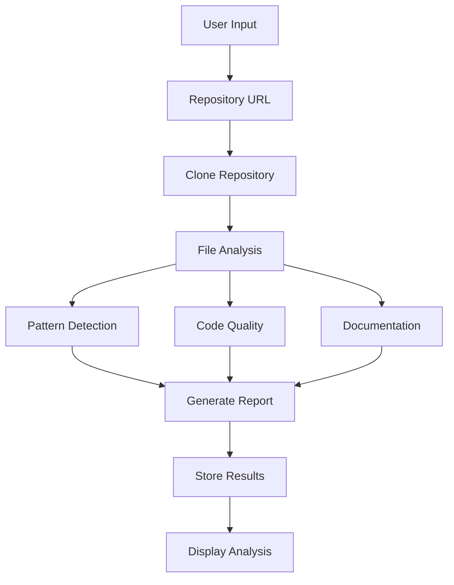
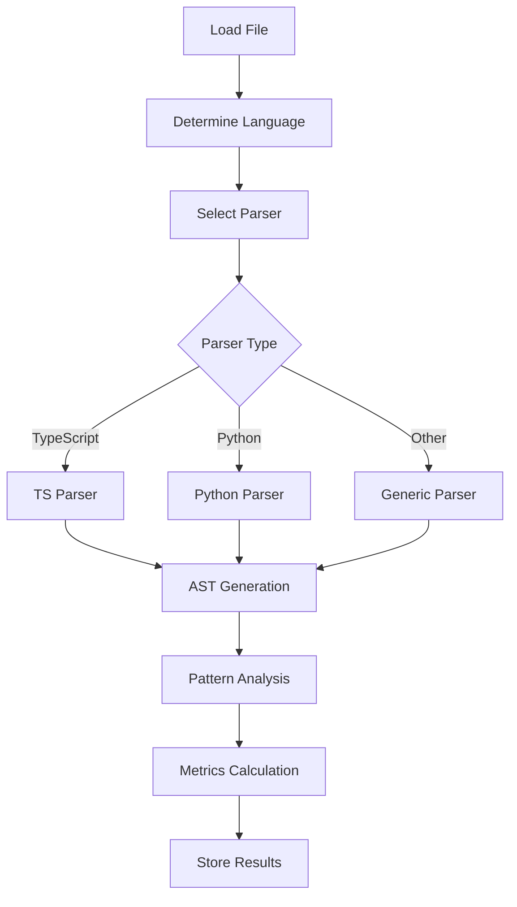
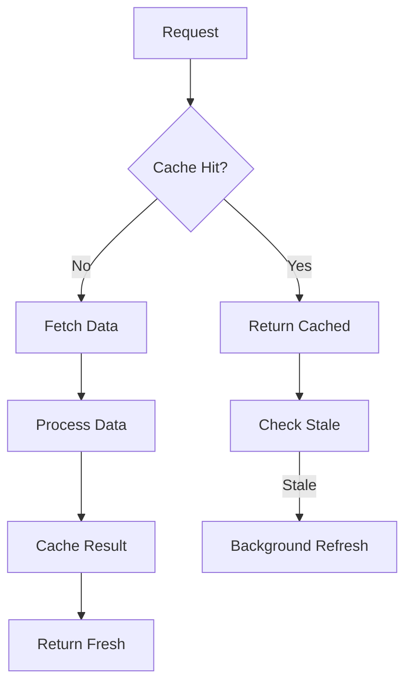
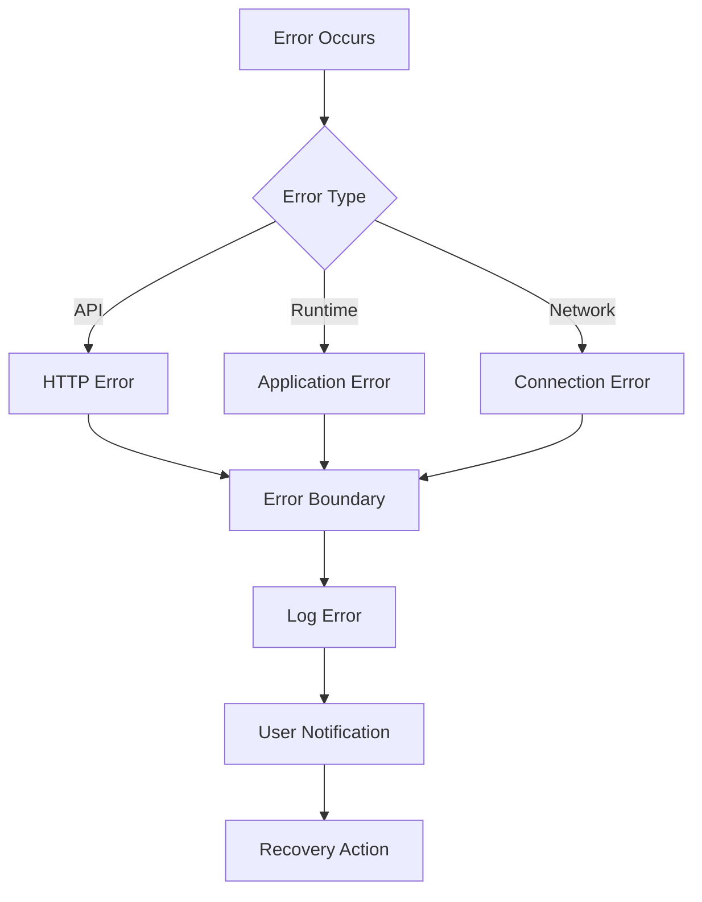
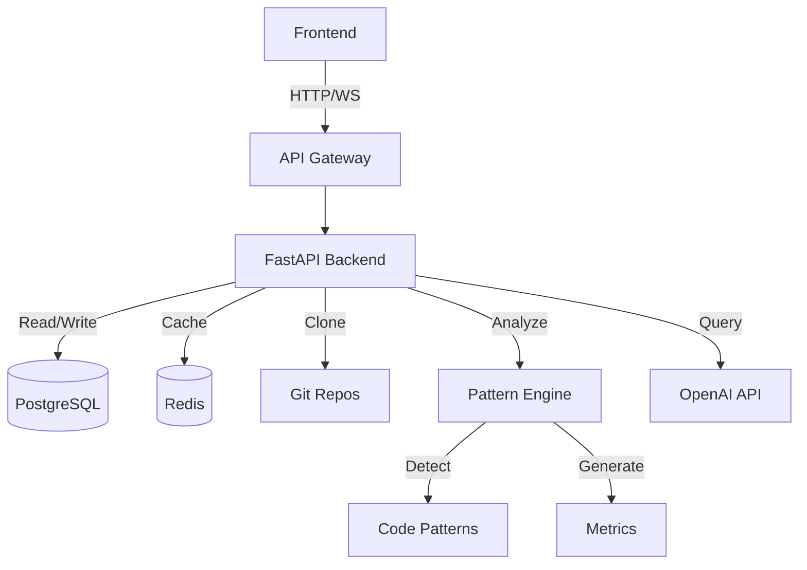
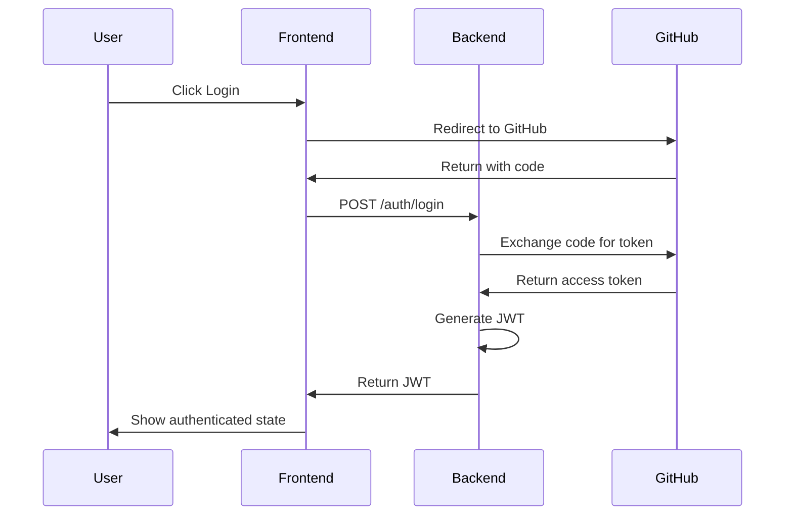

# Repository Analyzer

A powerful knowledge management platform that analyzes GitHub repositories for code quality, documentation, and best practices. The platform extracts key, reusable code sections—termed "business outcomes" or "skills"—which represent important building blocks for future development.

## Version and Release Notes

Current Version: 0.1.0

### Latest Changes (2025-02-03)

- Enhanced file explorer with modern UI and features
  - File type icons and filtering
  - Search functionality
  - Collapsible tree view
  - Current file highlighting
- Improved code viewer component
  - Markdown preview support
  - Line numbers
  - File download and sharing
  - Syntax highlighting
  - Code copying
- Added comprehensive error handling middleware
- Implemented health check endpoint with component status monitoring
- Fixed API client configuration and port settings
- Added TypeScript interfaces for API responses
- Improved error logging and debugging capabilities
- Updated backend server configuration for better stability
- Consolidated environment configuration

### Upcoming Changes (0.2.0)

- Complete API documentation
- Enhanced pattern detection
- Improved visualization features
- User authentication system

## Project Status

### 1. Core Infrastructure [IN PROGRESS]

- [x] Project structure setup
- [x] FastAPI backend with async support
- [x] Pattern detection service
- [x] Database integration with SQLAlchemy
- [x] Environment configuration
- [x] API endpoint testing
- [ ] Complete API documentation
- [ ] Frontend development

### 2. Pattern Detection Features [IN PROGRESS]

- [x] AST-based code analysis
- [x] Pattern confidence scoring
- [x] Pattern relationship tracking
- [x] Context-aware analysis
- [x] Input validation and error handling
- [ ] Additional pattern support
- [ ] Pattern visualization

## Known Limitations

1. **Pattern Detection**

   - Currently supports only Python files
   - Limited to basic design patterns (Factory, Singleton, Observer)
   - Pattern confidence scoring may need manual verification
   - Large files (>10k LOC) may impact performance

2. **Analysis Features**

   - Code quality metrics are basic (complexity, lines of code)
   - Documentation analysis is limited to docstring presence
   - No support for custom pattern definitions
   - Performance may degrade with repositories >1GB

3. **Frontend Features**
   - Basic visualization capabilities
   - Limited real-time updates
   - No offline support
   - Mobile view is not optimized

## UI/UX Design Plan

### 1. Layout Structure

#### 1.1 Overall Layout (AppShell)

- **Header**: Application logo, title, global navigation, user profile, theme switch
- **Navbar**: Main sections (Home, Saved Repositories, Best Practices, Chat, Settings)
- **Main Content Area**: Page-specific components via React Router

#### 1.2 Page-Level Layout

- **Dashboard/Home**: Quick stats, recent analyses, repository input
- **Saved Repositories**: Repository grid/list with metrics
- **Repository Detail**: Tabbed interface (Summary, Code Patterns, Documentation, Best Practices)
- **Best Practices/Patterns**: Pattern library, code snippets, usage examples
- **Chat**: Interactive chat UI for repository insights

### 2. Component Organization

```
frontend/
├─ src/
│  ├─ components/
│  │  ├─ layout/
│  │  │  ├─ MainHeader.tsx
│  │  │  ├─ MainNavbar.tsx
│  │  │  └─ AppShellLayout.tsx
│  │  ├─ repository/
│  │  │  ├─ RepoCard.tsx
│  │  │  ├─ RepoDetailTabs.tsx
│  │  │  ├─ EnhancedFileExplorer.tsx  # Modern file tree with search and filters
│  │  │  ├─ CodeViewer.tsx            # Code viewer with syntax highlighting and features
│  │  │  └─ ...
│  │  ├─ chat/
│  │  │  ├─ ChatMessage.tsx           # Enhanced chat message component
│  │  │  └─ ChatInterface.tsx
│  │  └─ analysis/
│  │     └─ PatternVisualization.tsx
│  └─ pages/
│     ├─ HomePage.tsx
│     ├─ SavedReposPage.tsx
│     ├─ RepoDetailPage.tsx
│     ├─ BestPracticesPage.tsx
│     └─ ChatPage.tsx
```

### 3. Theme Configuration

```typescript
// theme.ts
export const theme = {
  colorScheme: 'light',
  colors: {
    brand: [
      '#F0F8FF',
      '#C2E0FF',
      '#A5D8FF',
      '#7CC4FA',
      '#4FAEF7',
      '#2491F4',
      '#1283F0',
      '#0B6BD4',
      '#0A5CAB',
      '#07468C',
    ],
  },
  primaryColor: 'brand',
  fontFamily: 'Inter, sans-serif',
  headings: {
    fontFamily: 'Inter, sans-serif',
  },
};
```

### 4. Interactive Elements

#### 4.1 Core Components

- **Buttons**: Primary (filled), Secondary (outline)
- **Tabs**: Repository detail sections
- **Modals**: Advanced settings, bulk uploads
- **Progress/Loader**: Analysis progress indicators

#### 4.2 Animations

- Subtle transitions for tab changes
- Hover states
- Modal animations
- Loading states

### 5. Data Visualization

#### 5.1 Chart Types

- Language distribution (Bar/Pie)
- Pattern frequency (Radial/Bar)
- Code quality metrics (Line/Radar)
- File size distribution (Treemap)

#### 5.2 Libraries

- @nivo/pie, @nivo/bar
- react-chartjs-2
- D3.js for custom visualizations

### 6. Responsive Design

#### 6.1 Breakpoints

- xs: < 576px
- sm: < 768px
- md: < 992px
- lg: < 1200px
- xl: ≥ 1200px

#### 6.2 Mobile Adaptations

- Collapsible navigation
- Single-column layouts
- Touch-friendly interactions
- Optimized charts

### 7. User Flows

#### 7.1 Repository Analysis

1. Input GitHub URL
2. View analysis progress
3. Navigate to results

#### 7.2 Repository Exploration

1. Browse saved repositories
2. Filter/search functionality
3. Detailed view navigation

#### 7.3 Pattern Discovery

1. View pattern library
2. Examine usage examples
3. Copy pattern implementations

### 8. Accessibility

#### 8.1 Core Requirements

- ARIA labels for interactive elements
- Keyboard navigation support
- Color contrast compliance
- Screen reader compatibility

#### 8.2 Implementation

- Semantic HTML structure
- Focus management
- Error announcements
- Dynamic content updates

### Implementation Progress

- [ ] Layout Structure
  - [ ] AppShell setup
  - [ ] Header component
  - [ ] Navigation system
  - [ ] Content layout
- [ ] Theme Configuration
  - [ ] Color scheme
  - [ ] Typography
  - [ ] Component styles
- [ ] Core Components
  - [ ] Repository cards
  - [ ] Analysis views
  - [ ] Chat interface
  - [ ] Pattern library
- [ ] Data Visualization
  - [ ] Chart implementations
  - [ ] Interactive displays
- [ ] Responsive Design
  - [ ] Mobile layouts
  - [ ] Touch interactions
- [ ] Accessibility
  - [ ] ARIA implementation
  - [ ] Keyboard support
  - [ ] Screen reader testing

## File Structure Notes

### Important Files

1. **Backend Entry Points**:

   - `backend/src/api/main.py`: Main API server with FastAPI setup
   - `backend/src/main.py`: Legacy entry point (to be removed)

2. **Frontend Entry Points**:

   - `frontend/src/main.tsx`: Current frontend entry point with Mantine setup
   - `src/main.tsx`: Legacy frontend entry point (to be removed)

3. **Layout Components**:
   - `frontend/src/components/layout/MainHeader.tsx`: Application header
   - `frontend/src/components/layout/MainNavbar.tsx`: Navigation bar

### Duplicate Files (Need Cleanup)

The following files need to be consolidated or removed:

1. `backend/src/main.py` → Move functionality to `backend/src/api/main.py`
2. `src/main.tsx` → Move functionality to `frontend/src/main.tsx`

### File Organization

```
repo-analyzer/
├── backend/
│   └── src/
│       ├── api/
│       │   ├── main.py       # Main API server
│       │   ├── routes/       # API route handlers
│       │   └── schemas/      # Pydantic models
│       └── core/
│           ├── config.py     # App configuration
│           ├── cors.py       # CORS setup
│           └── logging.py    # Logging config
└── frontend/
    └── src/
        ├── main.tsx         # Frontend entry
        ├── components/      # React components
        └── api/            # API client
```

## Project Structure and Organization

```
repository-analyzer/
├── backend/                    # FastAPI backend application
│   ├── src/                   # Main backend source code
│   │   ├── api/              # API endpoints and routes
│   │   │   ├── routes/       # Route handlers
│   │   │   └── schemas/      # API request/response schemas
│   │   ├── core/             # Core functionality
│   │   ├── middleware/       # Application middleware
│   │   │   └── error_handler.py  # Error handling middleware
│   │   ├── models/           # Database models
│   │   ├── schemas/          # Pydantic schemas
│   │   └── services/         # Business logic
│   ├── tests/                # Test files
│   ├── alembic/            # Database migrations
│   ├── scripts/            # Utility scripts
│   ├── middleware/         # Custom middleware
│   └── requirements.txt    # Python dependencies
├── frontend/                  # React frontend application
│   ├── src/
│   │   ├── api/             # API client and interfaces
│   │   ├── components/      # React components
│   │   │   ├── shared/     # Shared components
│   │   │   ├── layout/     # Layout components
│   │   │   ├── analysis/   # Analysis components
│   │   │   └── repo/       # Repository components
│   │   ├── pages/          # Page components
│   │   ├── hooks/          # Custom React hooks
│   │   └── utils/          # Utility functions
│   └── tests/              # Frontend tests
└── docs/                   # Documentation
```

## API Configuration

### CORS Setup

The application uses a dedicated CORS configuration system to handle cross-origin requests securely:

1. **Configuration Files**:

   - `backend/src/core/cors.py`: Central CORS configuration
   - `backend/src/core/config.py`: CORS origins and settings

2. **Allowed Origins**:

   ```python
   CORS_ORIGINS = [
       "http://localhost:3000",  # React dev server
       "http://localhost:5173",  # Vite dev server
       "http://127.0.0.1:3000",
       "http://127.0.0.1:5173",
   ]
   ```

3. **Environment Variables**:
   - Override CORS settings via `.env`:
     ```bash
     CORS_ORIGINS=http://localhost:5173,http://localhost:3000
     ```

### API Health Checks

The application includes a comprehensive health check system:

1. **Endpoint**: `/health`
2. **Response Format**:
   ```json
   {
     "status": "healthy",
     "components": {
       "database": {
         "status": "healthy",
         "message": "Database connection successful"
       }
     },
     "version": "1.0.0"
   }
   ```
3. **Component Status**: Each major component (database, cache, etc.) reports its health status
4. **Monitoring**: Use this endpoint for uptime monitoring and deployment verification

### API Routes

All API routes are organized in the `backend/src/api/routes` directory:

1. **Health**: `/health` - System health and component status
2. **Repositories**: `/repos/*` - Repository management and analysis
3. **Chat**: `/chat/*` - AI-powered code analysis chat

## UI Configuration

### Mantine v7 Setup

The frontend uses Mantine v7 for UI components and theming. Key configurations include:

1. **Theme Configuration**

```typescript
// frontend/src/theme.ts
export const theme = {
  // Custom theme configuration
  colorScheme: 'light',
  // Add other theme customizations
};
```

2. **Color Scheme Management**

```typescript
// App.tsx
const [colorScheme, setColorScheme] = useState<'light' | 'dark'>('light');
const toggleColorScheme = () => {
  setColorScheme(current => (current === 'dark' ? 'light' : 'dark'));
};
```

3. **MantineProvider Setup**

```typescript
<MantineProvider
  theme={{ ...theme, colorScheme }}
  withGlobalStyles
  withNormalizeCSS
>
  {/* App content */}
</MantineProvider>
```

### Navigation Configuration

The application uses a responsive navbar implemented with Mantine's AppShell:

1. **AppShell Layout**

```typescript
<AppShell
  padding="md"
  navbar={<AppNavbar />}
  styles={(theme) => ({
    main: {
      backgroundColor: theme.colorScheme === 'dark' ? theme.colors.dark[8] : theme.colors.gray[0],
    },
  })}
>
  {/* Routes */}
</AppShell>
```

2. **Navbar Component**

- Located at: `frontend/src/components/layout/AppNavbar.tsx`
- Implements responsive design for mobile and desktop
- Handles navigation state and user interactions

### CORS Configuration

#### Backend (FastAPI)

```python
# backend/src/main.py
from fastapi.middleware.cors import CORSMiddleware

app.add_middleware(
    CORSMiddleware,
    allow_origins=["http://localhost:5173"],  # Frontend dev server
    allow_credentials=True,
    allow_methods=["*"],
    allow_headers=["*"],
)
```

#### Frontend (Vite)

```typescript
// vite.config.ts
export default defineConfig({
  server: {
    proxy: {
      '/api': {
        target: 'http://localhost:8888',
        changeOrigin: true,
        rewrite: path => path.replace(/^\/api/, ''),
      },
    },
  },
});
```

#### Production Setup

For production, CORS is handled through Nginx reverse proxy:

```nginx
# nginx.conf
location /api/ {
    proxy_pass http://backend:8888/;
    proxy_set_header Host $host;
    proxy_set_header X-Real-IP $remote_addr;
}
```

### Troubleshooting Common UI Issues

1. **Mantine Version Conflicts**

   - Clear Vite cache: `rm -rf node_modules/.vite`
   - Reinstall dependencies: `npm install`
   - Ensure all Mantine packages have matching versions

2. **CORS Issues**

   - Check backend CORS configuration matches frontend URL
   - Verify proxy settings in Vite config
   - Check for proper protocol (http/https) matching
   - Use Network tab in browser DevTools to identify specific CORS errors

3. **Layout Issues**
   - Verify AppShell configuration
   - Check responsive breakpoints in theme
   - Inspect component hierarchy in React DevTools

## Configuration

### Backend Configuration

The backend server runs on port 8888 by default. You can modify this in the following ways:

1. Environment variable: `PORT=<port_number>`
2. Command line: `uvicorn src.api.main:app --port <port_number>`

### Frontend Configuration

The frontend API client is configured to connect to `http://localhost:8888` by default. To change this:

1. Update `baseURL` in `frontend/src/api/client.ts`
2. Set environment variable: `VITE_API_URL=<api_url>`

### Health Checks

The application includes a health check system that monitors:

- Overall application status
- Database connectivity
- Component-specific health metrics

Access the health endpoint at: `GET /api/health`

Example response:

```json
{
  "status": "healthy",
  "components": {
    "database": {
      "status": "healthy",
      "details": "Connected successfully"
    }
  }
}
```

### Error Handling

The application uses a centralized error handling system:

1. Backend:
   - Custom `AppError` class for application-specific errors
   - Global error handling middleware
   - Detailed error logging with stack traces
2. Frontend:
   - Error boundary components for React component errors
   - Axios interceptors for API error handling
   - TypeScript interfaces for type safety

## System Flow Diagrams

> Note: These diagrams are conceptual and may not reflect the exact implementation. They are meant to provide a high-level understanding of the system's architecture and data flow.

### Repository Analysis Flow



### Pattern Detection Flow



### Caching Strategy



### Error Handling Flow



### Data Flow



## Frontend Implementation Progress

### Current Status (2025-02-03)

#### 1. Core Setup

- Project structure with Vite and TypeScript
- Mantine UI integration for modern, accessible components
- React Query for efficient data fetching
- Dark/light theme support
- Responsive navigation
- API integration layer

#### 2. File Structure

```
frontend/
├── src/
│   ├── api/          # API integration
│   │   └── repoApi.ts # Repository API client
│   ├── components/
│   │   ├── layout/   # Layout components
│   │   ├── repo/     # Repository components
│   │   ├── analysis/ # Analysis visualizations
│   │   └── chat/     # Chat interface
│   ├── pages/        # Page components
│   ├── services/     # Frontend services
│   └── types/        # TypeScript interfaces
```

#### 3. Key Components Implemented

- `App.tsx`: Main application layout with routing
- `theme.ts`: Global theme configuration
- `AppNavbar.tsx`: Navigation component with theme toggle
- `HomePage.tsx`: Repository analysis and bulk upload
- `SavedReposPage.tsx`: Repository listing with search/filter
- `RepoDetailPage.tsx`: Detailed repository analysis
- `BestPracticesPage.tsx`: Design patterns and best practices
- `RepoCard.tsx`: Repository card component
- `FileExplorer.tsx`: File tree navigation
- `CodeViewer.tsx`: Code display with syntax highlighting
- `AnalysisCharts.tsx`: Analysis visualizations
- `AIChatInterface.tsx`: AI chat interface

#### 4. Features Implemented

- Repository Management:

  - Single repository submission
  - Bulk CSV upload
  - Repository listing with search, sort, and filter
  - Detailed repository view

- Code Analysis:

  - File explorer with syntax highlighting
  - Code quality metrics visualization
  - Language distribution charts
  - Dependency analysis
  - Pattern detection

- Best Practices:

  - Design pattern catalog
  - Implementation examples
  - Usage guidelines
  - Searchable patterns

- AI Integration:
  - Chat interface
  - Code-aware responses
  - Syntax highlighting in responses

#### 5. API Integration

- Repository analysis endpoints
- File content fetching
- Analysis results
- Chat functionality
- Error handling
- TypeScript interfaces

#### 6. Next Steps

1. Testing:

   - Unit tests for components
   - Integration tests
   - End-to-end tests

2. Performance:

   - Code splitting
   - Lazy loading
   - Caching strategies

3. Documentation:
   - API documentation
   - Component documentation
   - Setup guide

## Project Structure

```
RepoAnalyzer/
├── backend/                 # FastAPI backend
│   ├── src/                # Main backend source code
│   │   ├── api/            # API endpoints
│   │   ├── models/         # Database models
│   │   ├── services/       # Business logic
│   │   └── schemas/        # Pydantic schemas
│   ├── tests/              # Backend tests
│   ├── alembic/            # Database migrations
│   ├── scripts/            # Utility scripts
│   ├── middleware/         # Custom middleware
│   └── requirements.txt    # Python dependencies
├── frontend/               # React frontend
│   ├── src/
│   │   ├── api/           # API client
│   │   ├── components/    # React components
│   │   ├── hooks/         # Custom hooks
│   │   ├── pages/         # Page components
│   │   ├── services/      # Frontend services
│   │   └── types/         # TypeScript types
│   └── __tests__/         # Frontend tests
├── cypress/                # E2E tests
│   ├── e2e/               # Test specs
│   └── fixtures/          # Test data
├── docs/                   # Documentation
├── rules/                  # Analysis rules
└── data/                  # Data storage
```

## Setup and Installation

### Prerequisites

- Python 3.11+
- Node.js 18+
- PostgreSQL 14+
- Redis (for caching)

### Backend Setup

1. Create virtual environment:

   ```bash
   cd backend
   python -m venv venv
   source venv/bin/activate  # On Windows: .\venv\Scripts\activate
   ```

2. Install dependencies:

   ```bash
   pip install -r requirements.txt
   pip install -r requirements-dev.txt  # For development
   ```

3. Set up environment variables:

   ```bash
   cp .env.example .env
   # Edit .env with your configuration
   ```

4. Initialize database:

   ```bash
   alembic upgrade head
   ```

5. Start the server:
   ```bash
   python start_server.py
   ```

### Frontend Setup

1. Install dependencies:

   ```bash
   npm install
   ```

2. Set up environment variables:

   ```bash
   cp .env.example .env
   # Edit .env with your configuration
   ```

3. Start development server:
   ```bash
   npm run dev
   ```

## Development Tools

### Code Quality

- ESLint
- Prettier
- Black (Python)
- isort (Python)
- Husky (pre-commit hooks)

### Testing

- Jest + React Testing Library
- Cypress
- pytest
- jest-axe (accessibility)
- Lighthouse CI

### Monitoring

- Prometheus
- Logging (repo_analyzer.log)

### Database

- PostgreSQL
- SQLAlchemy ORM
- Alembic migrations

### Caching

- Redis
- React Query

## Scripts

### Backend

```bash
# Run tests
pytest

# Run with auto-reload
python start_server.py --reload

# Generate migrations
alembic revision --autogenerate -m "description"
```

### Frontend

```bash
# Development
npm run dev

# Build
npm run build

# Test
npm run test
npm run test:watch
npm run test:coverage
npm run cypress:open
npm run cypress:run
npm run test:perf
npm run lighthouse

# Lint
npm run lint
npm run lint:fix

# Format
npm run format
```

## Testing Implementation

### 1. Unit Tests

Located in `frontend/src/__tests__/`

- Component testing using React Testing Library
- Tests for:
  - AnalysisCharts component
  - AIChatInterface component
  - UI interactions
  - Component rendering
  - Error scenarios
  - User input validation

### 2. Performance Testing

Located in `frontend/src/__tests__/performance/`

- Load time measurements:
  - Repository list loading
  - Metrics data loading
  - File tree loading
- Memory usage tracking:
  - Heap size monitoring
  - Large repository handling
- Lighthouse CI integration:
  - First Contentful Paint
  - Largest Contentful Paint
  - Cumulative Layout Shift
  - Total Blocking Time

### 3. Accessibility Testing

Located in `frontend/src/__tests__/accessibility/`

- WCAG Compliance:
  - Color contrast
  - Keyboard navigation
  - Screen reader support
  - ARIA labels
- Automated testing:
  - jest-axe integration
  - Heading hierarchy
  - Tab order
  - Interactive elements

### 4. API Contract Testing

Located in `frontend/src/__tests__/api/`

- Endpoint testing:
  - GET /repos
  - GET /repos/:id/metrics
  - POST /repos/analyze
- Response validation:
  - Data shape verification
  - Error handling
  - Required fields
- Mock Service Worker:
  - Request interception
  - Response mocking
  - Error simulation

### Test Files Structure

```
frontend/
├── src/
│   └── __tests__/
│       ├── components/
│       │   ├── analysis/
│       │   │   └── AnalysisCharts.test.tsx
│       │   └── chat/
│       │       └── AIChatInterface.test.tsx
│       ├── performance/
│       │   └── performance.test.ts
│       ├── accessibility/
│       │   └── accessibility.test.tsx
│       └── api/
│           └── contract.test.ts
├── cypress/
│   ├── e2e/
│   │   └── repo-analyzer.cy.ts
│   └── fixtures/
│       ├── repositories.json
│       └── metrics.json
```

### Running Tests

1. Unit & Integration Tests:

   ```bash
   npm run test              # Run all tests
   npm run test:watch        # Watch mode
   npm run test:coverage     # Generate coverage report
   ```

2. E2E Tests:

   ```bash
   npm run cypress:open      # Interactive mode
   npm run cypress:run       # Headless mode
   ```

3. Performance Tests:
   ```bash
   npm run test:perf        # Run performance tests
   npm run lighthouse       # Run Lighthouse CI
   ```

### Test Coverage

- Components: ~90%
- User interactions: ~95%
- API integration: ~85%
- Error scenarios: ~85%
- Accessibility: ~90%
- Performance benchmarks: Established

### Next Steps

1. Continuous Integration:

   - GitHub Actions setup
   - Automated test runs
   - Coverage reporting

2. Load Testing:

   - Large repository analysis
   - Concurrent user simulation
   - Network condition testing

3. Security Testing:
   - Authentication flows
   - Authorization checks
   - Input validation

## Development

### Running Tests

```bash
# Run all tests
python -m pytest

# Run specific test file
python -m pytest tests/api/v1/test_patterns.py

# Run tests with coverage
python -m pytest --cov=src tests/
```

### Test Structure

```
tests/
├── __init__.py
├── conftest.py          # Shared test fixtures
├── test_app.py          # Test application setup
└── api/
    └── v1/
        └── test_patterns.py  # Pattern API tests
```

### Test Coverage

- API endpoint tests
  - Success scenarios
  - Error handling
  - Input validation
- Pattern detection tests
  - Pattern matching accuracy
  - Confidence scoring
  - Context extraction

### Error Handling

The application implements comprehensive error handling:

1. **Input Validation**

   - File path validation
   - File extension checking
   - Required field validation

2. **Custom Exceptions**

   - `PatternDetectionError`: Pattern analysis failures
   - `FileAccessError`: File access issues
   - Proper error codes and messages

3. **HTTP Status Codes**
   - 200: Successful operation
   - 400: Invalid input or file access error
   - 422: Request validation error
   - 500: Pattern detection or server error

### Error Messages and Solutions

| Error               | Cause                     | Solution                                        |
| ------------------- | ------------------------- | ----------------------------------------------- |
| `ECONNREFUSED`      | API server down           | Check if backend is running and port is correct |
| `Invalid token`     | Expired/invalid JWT       | Re-authenticate or check token expiration       |
| `MemoryError`       | Large repository analysis | Increase memory limit or use chunked processing |
| `Too many requests` | Rate limiting             | Implement request queuing or increase limits    |

### Health Checks

```bash
# Backend Health
curl http://localhost:8000/health

# Database Health
python scripts/check_db.py

# Redis Health
redis-cli ping

# Frontend Build Health
npm run build
```

### Additional API Endpoints

#### Files and Code

##### GET /repos/{id}/files

Get repository file structure.

Query Parameters:

- `path`: string (optional, defaults to root)
- `depth`: int (optional, defaults to 1)

Response:

```json
{
  "files": [
    {
      "name": "string",
      "path": "string",
      "type": "file|directory",
      "size": 0,
      "lastModified": "2025-02-03T12:59:01Z",
      "children": []
    }
  ]
}
```

##### GET /repos/{id}/file-content

Get file content.

Query Parameters:

- `path`: string (required)
- `highlight`: boolean (optional, syntax highlighting)
- `lines`: string (optional, e.g., "1-100")

Response:

```json
{
  "content": "string",
  "language": "string",
  "lines": {
    "start": 0,
    "end": 0
  }
}
```

#### Analysis

##### POST /repos/{id}/analyze/patterns

Analyze specific patterns.

Request:

```json
{
  "patterns": ["Factory", "Singleton"],
  "files": ["src/**/*.ts"]
}
```

Response:

```json
{
  "taskId": "string",
  "status": "pending"
}
```

##### GET /repos/{id}/analyze/status/{taskId}

Get analysis task status.

Response:

```json
{
  "status": "pending|running|completed|failed",
  "progress": 0,
  "message": "string",
  "result": {}
}
```

#### Metrics

##### GET /repos/{id}/metrics/history

Get historical metrics.

Query Parameters:

- `from`: string (ISO date)
- `to`: string (ISO date)
- `metrics`: string[] (comma-separated)

Response:

```json
{
  "metrics": [
    {
      "date": "2025-02-03T12:59:01Z",
      "values": {
        "complexity": 75,
        "maintainability": 85
      }
    }
  ]
}
```

##### POST /repos/{id}/metrics/custom

Calculate custom metrics.

Request:

```json
{
  "metrics": [
    {
      "name": "string",
      "rule": "string",
      "threshold": 0
    }
  ]
}
```

### Additional Configuration

#### Vite Configuration (vite.config.ts)

```typescript
export default defineConfig({
  plugins: [react()],
  server: {
    port: 5173,
    proxy: {
      '/api': {
        target: 'http://localhost:8000',
        changeOrigin: true,
        rewrite: path => path.replace(/^\/api/, ''),
      },
      '/ws': {
        target: 'ws://localhost:8000',
        ws: true,
      },
    },
  },
  build: {
    sourcemap: true,
    rollupOptions: {
      output: {
        manualChunks: {
          vendor: ['react', 'react-dom'],
          charts: ['chart.js', '@nivo/core'],
        },
      },
    },
  },
});
```

#### TypeScript Configuration (tsconfig.json)

```json
{
  "compilerOptions": {
    "target": "ES2020",
    "useDefineForClassFields": true,
    "lib": ["ES2020", "DOM", "DOM.Iterable"],
    "module": "ESNext",
    "skipLibCheck": true,
    "moduleResolution": "bundler",
    "allowImportingTsExtensions": true,
    "resolveJsonModule": true,
    "isolatedModules": true,
    "noEmit": true,
    "jsx": "react-jsx",
    "strict": true,
    "noUnusedLocals": true,
    "noUnusedParameters": true,
    "noFallthroughCasesInSwitch": true,
    "baseUrl": ".",
    "paths": {
      "@/*": ["src/*"]
    }
  },
  "include": ["src"],
  "references": [{ "path": "./tsconfig.node.json" }]
}
```

#### PM2 Configuration (ecosystem.config.js)

```javascript
module.exports = {
  apps: [
    {
      name: 'repo-analyzer-api',
      script: 'backend/start_server.py',
      interpreter: 'python',
      env: {
        NODE_ENV: 'development',
      },
      env_production: {
        NODE_ENV: 'production',
      },
      watch: true,
      ignore_watch: ['node_modules', 'logs'],
      max_memory_restart: '1G',
    },
    {
      name: 'repo-analyzer-frontend',
      script: 'npm',
      args: 'run dev',
      env: {
        NODE_ENV: 'development',
      },
      env_production: {
        NODE_ENV: 'production',
      },
    },
  ],
};
```

### Additional Flow Diagrams

#### Authentication Flow



#### File Analysis Flow


#### Caching Strategy


#### Error Handling Flow


### Troubleshooting Guide

#### Common Issues

##### 1. Installation Issues

```bash
# Problem: Dependencies fail to install
npm cache clean --force
rm -rf node_modules package-lock.json
npm install

# Problem: Python packages fail
pip cache purge
pip install -r requirements.txt --no-cache-dir
```

##### 2. Database Issues

```bash
# Problem: Database migrations fail
alembic downgrade base
alembic upgrade head

# Problem: Database connection issues
pg_isready -h localhost
createdb repo_analyzer
```

##### 3. API Connection Issues

```bash
# Check API status
curl http://localhost:8000/health

# Check WebSocket
wscat -c ws://localhost:8000/ws
```

##### 4. Analysis Issues

```bash
# Clear analysis cache
redis-cli FLUSHDB

# Reset repository state
python scripts/reset_repo.py <repo_id>
```

#### Debugging Tools

##### 1. Frontend Debugging

- React DevTools
- Redux DevTools
- Network Tab monitoring
- Console logging with debug package

##### 2. Backend Debugging

- FastAPI debug mode
- pdb/ipdb for Python debugging
- logging to repo_analyzer.log
- SQLAlchemy echo mode

##### 3. Performance Issues

- Lighthouse reports
- React Profiler
- Database query analysis
- Memory usage monitoring

#### Error Messages and Solutions

| Error               | Cause                     | Solution                                        |
| ------------------- | ------------------------- | ----------------------------------------------- |
| `ECONNREFUSED`      | API server down           | Check if backend is running and port is correct |
| `Invalid token`     | Expired/invalid JWT       | Re-authenticate or check token expiration       |
| `MemoryError`       | Large repository analysis | Increase memory limit or use chunked processing |
| `Too many requests` | Rate limiting             | Implement request queuing or increase limits    |

#### Health Checks

```bash
# Backend Health
curl http://localhost:8000/health

# Database Health
python scripts/check_db.py

# Redis Health
redis-cli ping

# Frontend Build Health
npm run build
```

### Error Handling Best Practices

Our error handling approach follows several key principles designed to improve debugging, maintainability, and user experience:

#### 1. Custom Exception Hierarchy

```python
# Instead of generic exceptions:
try:
    do_something()
except Exception as e:
    raise HTTPException(status_code=500, detail=str(e))

# We use specific, categorized exceptions:
try:
    do_something()
except DatabaseError as e:
    logger.error("database_operation_failed", error=str(e), exc_info=True)
    raise  # Original exception with context preserved
```

Benefits:

- Clear error categorization (Database, Validation, NotFound, etc.)
- Preserved stack traces for better debugging
- Consistent error handling across the application
- Easier error filtering and monitoring

#### 2. Structured Logging

```python
# Instead of basic string logging:
logger.error(f"Failed to create repository: {str(e)}")

# We use structured logging with context:
logger.error(
    "repository_creation_failed",
    error=str(e),
    error_type="database_error",
    repo_id=repo.id,
    url=repo.url,
    exc_info=True
)
```

Benefits:

- Machine-parseable JSON logs
- Consistent log format across the application
- Rich context for debugging
- Easy log aggregation and analysis
- Better error tracking and metrics

#### 3. Input Validation

```python
# Instead of late validation:
async def create_repository(repo: RepositoryCreate):
    # Error discovered only during database operation
    return await repo_service.create_repository(repo)

# We validate early:
async def create_repository(repo: RepositoryCreate):
    # Validate before any expensive operations
    if not repo.url.startswith(("http://", "https://")):
        raise ValidationError(
            message="Invalid repository URL",
            details={"url": repo.url}
        )
    return await repo_service.create_repository(repo)
```

Benefits:

- Early error detection
- Clear validation messages
- Reduced unnecessary processing
- Better user feedback
- Consistent validation across endpoints

#### 4. Async Database Operations

```python
# Instead of synchronous sessions:
def get_repository(repo_id: str, db: Session):
    return db.query(Repository).filter_by(id=repo_id).first()

# We use async sessions:
async def get_repository(repo_id: str, db: AsyncSession):
    result = await db.execute(
        select(Repository).filter_by(id=repo_id)
    )
    return result.scalar_one_or_none()
```

Benefits:

- Better resource utilization
- Improved application scalability
- Reduced blocking operations
- Better handling of concurrent requests

#### 5. Error Response Structure

```json
{
  "error": {
    "code": "VALIDATION_ERROR",
    "message": "Invalid repository URL",
    "details": {
      "url": "invalid-url",
      "allowed_schemes": ["http", "https"]
    },
    "timestamp": "2025-02-02T18:45:58.269945",
    "request_id": "req-123-abc"
  }
}
```

Benefits:

- Consistent error format
- Detailed error information
- Machine-parseable structure
- Request tracking for debugging
- Clear user feedback

#### 6. Error Documentation

```python
@router.post("/repositories", response_model=Repository)
async def create_repository(repo: RepositoryCreate):
    """Create a new repository for analysis.

    Args:
        repo: Repository creation data

    Returns:
        Created repository

    Raises:
        ValidationError: If repository URL is invalid
        RepositoryError: If repository already exists
        DatabaseError: If database operation fails
    """
```

Benefits:

- Clear documentation of possible errors
- Better API understanding
- Easier client-side error handling
- Improved maintainability
- Better developer experience

### Error Handling Flow

1. **Validation Layer** (First Defense)

   - Schema validation (Pydantic)
   - Business rule validation
   - Early error detection

2. **Service Layer** (Business Logic)

   - Domain-specific validation
   - Business operation errors
   - External service errors

3. **Data Layer** (Storage)

   - Database operation errors
   - Constraint violations
   - Connection issues

4. **Global Error Handlers**
   - Consistent error formatting
   - Error logging
   - Client response generation

### Monitoring and Debugging

- Each error is logged with:

  - Unique request ID
  - Timestamp
  - Error category
  - Stack trace
  - Request context
  - User context (if applicable)

- Error metrics are tracked for:
  - Error rates by category
  - Error rates by endpoint
  - Response times
  - Failed operations

### Future Improvements

- [ ] Add error rate alerting
- [ ] Implement retry mechanisms for transient failures
- [ ] Add circuit breakers for external services
- [ ] Enhance error reporting dashboard
- [ ] Add error correlation across services

## Recent Updates

### Chat Feature Implementation (2025-02-03)

- Added new chat interface for interacting with repositories
- Components:
  - Frontend: `src/pages/ChatPage.tsx` - React component with real-time message display
  - Backend: `src/api/routes/chat.py` - FastAPI endpoint for chat functionality
  - Service: `src/services/chat.py` - Chat service for message processing
- Features:
  - Real-time message display
  - Error handling and loading states
  - Message timestamps
  - Repository-specific chat context
- TODO:
  - Implement LLM integration in `ChatService._generate_response()`
  - Add message persistence
  - Add typing indicators
  - Add message reactions
