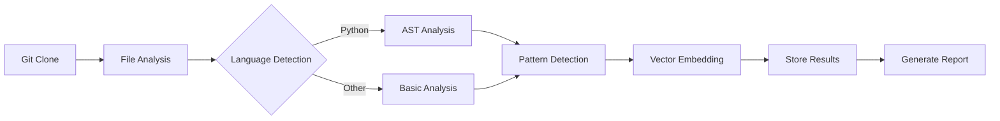
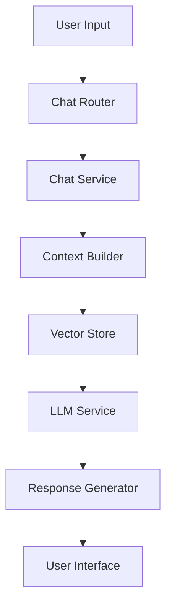
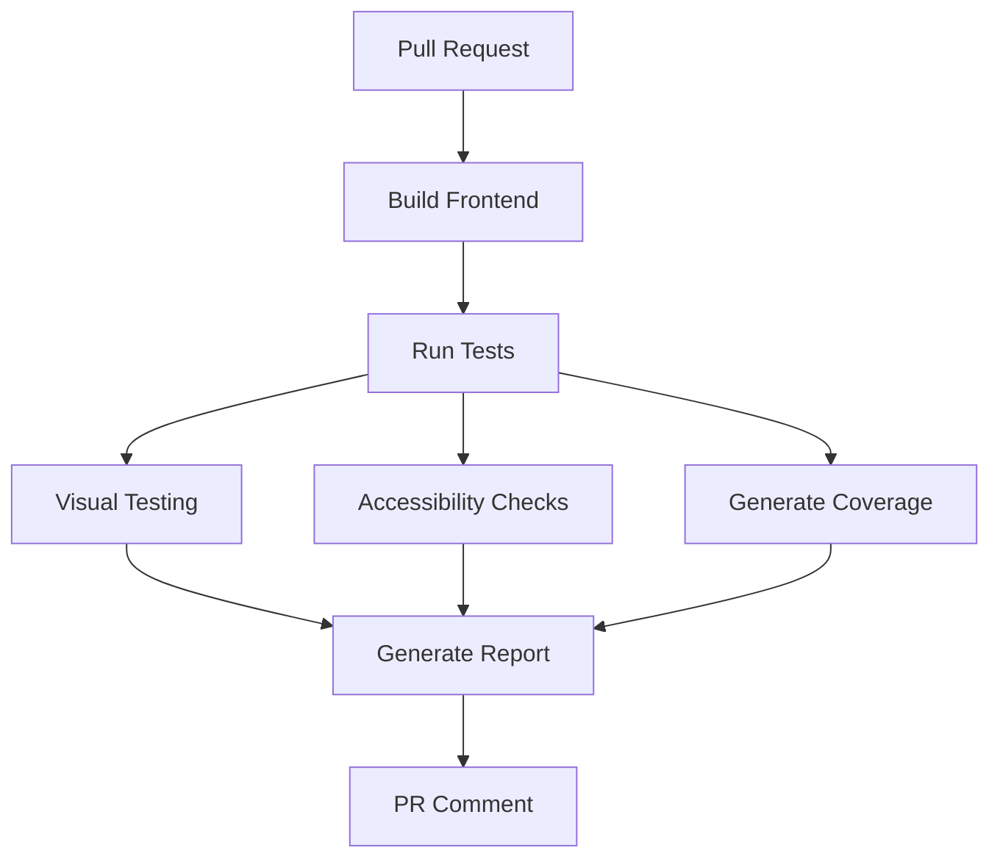
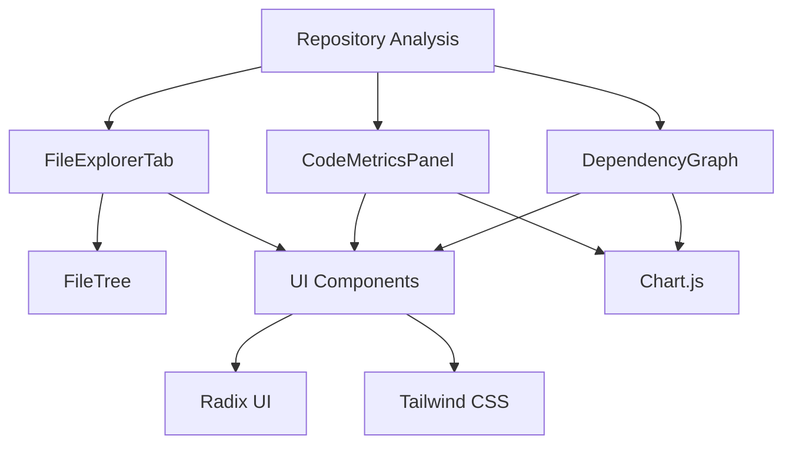
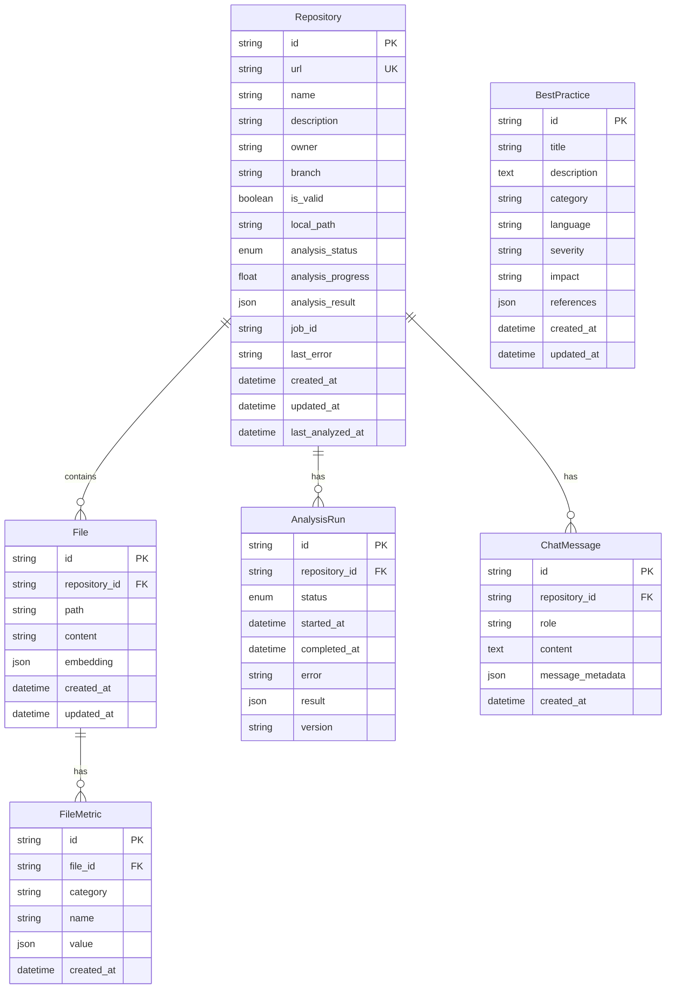

# Repository Analyzer

A powerful knowledge management platform that analyzes GitHub repositories for code quality, documentation, and best practices. The platform extracts key, reusable code sections—termed "business outcomes" or "skills"—which represent important building blocks for future development.

## Version and Release Notes

Current Version: 0.1.0

### Latest Changes (2025-02-06)

- Enhanced VectorStore component:
  - Improved metadata filtering with exact matching
  - Added robust collection cleanup between operations
  - Fixed duplicate chunk handling
  - Added comprehensive test coverage
  - Improved error handling and logging
- Implemented robust database initialization with SQLAlchemy
- Added core analysis components:
  - `CodeChunker`: Splits code into meaningful chunks with metadata
  - `CodeAnalyzer`: Analyzes code chunks for quality, complexity, and security
  - `VectorStore`: Stores and retrieves code chunks using vector embeddings
- Added comprehensive test suite for all components

### Component Structure

```
backend/
├── src/
│   ├── api/              # FastAPI endpoints
│   ├── analysis/         # Code analysis components
│   │   ├── analyzer.py   # Code quality analysis
│   │   └── chunker.py    # Code chunking logic
│   ├── storage/          # Data persistence
│   │   └── vector_store.py  # Vector-based code storage
│   ├── models/          # SQLAlchemy models
│   └── database.py      # Database configuration
├── tests/              # Test suite
│   └── test_components.py  # Component tests
└── data/              # Database and file storage
    └── repo_analyzer.db   # SQLite database
```

### Database Schema

The system uses SQLAlchemy 2.0 with async support. Key models include:

1. **Repository**

   - Stores repository information
   - Fields:
     - id: UUID primary key
     - name: Repository name
     - owner: Repository owner
     - url: Repository URL
     - created_at: Timestamp
     - updated_at: Timestamp

2. **CodeChunk**

   - Stores code segments with metadata
   - Fields:
     - id: UUID primary key
     - content: Code content
     - file_path: Path to source file
     - start_line: Starting line number
     - end_line: Ending line number
     - language: Programming language
     - repository_id: Foreign key to Repository
     - metadata: JSONB field for additional metadata
     - created_at: Timestamp
     - updated_at: Timestamp

3. **AnalysisResult**
   - Stores code analysis results
   - Fields:
     - id: UUID primary key
     - analysis_type: Type of analysis
     - score: Analysis score
     - details: JSONB field for detailed results
     - repository_id: Foreign key to Repository
     - created_at: Timestamp
     - updated_at: Timestamp

### Core Components

1. **CodeChunker**

   - Splits code files into logical chunks
   - Extracts metadata (file path, line numbers, size)
   - Handles multiple programming languages

2. **CodeAnalyzer**

   - Analyzes code quality metrics:
     - Complexity (cyclomatic, nested functions)
     - Quality (documentation, naming)
     - Security (unsafe patterns)
     - Performance metrics
   - Async processing for better performance

3. **VectorStore**
   - Stores code chunks with vector embeddings using ChromaDB
   - Enables semantic code search with metadata filtering
   - Supports:
     - Exact metadata matching with `$eq` operator
     - Batch operations for multiple chunks
     - Duplicate chunk ID handling
     - Collection cleanup and reset
   - Efficient similarity matching
   - Uses cosine similarity for vector comparisons
   - Comprehensive error handling and logging
   - Proper async/await support
   - Test isolation with collection cleanup

### Testing

The backend includes comprehensive tests:

- Unit tests for each component
- Integration tests for database operations
- Async test support with pytest-asyncio
- Proper test database isolation
- VectorStore specific tests:
  - Metadata filtering
  - Batch operations
  - Duplicate chunk handling
  - Empty query handling
  - Collection cleanup

### Development Setup

1. Create and activate virtual environment:

```bash
python -m venv venv
source venv/bin/activate  # On Windows: venv\Scripts\activate
```

2. Install dependencies:

```bash
pip install -r requirements.txt
```

3. Set up the database:

```bash
python -m src.database
```

4. Run tests:

```bash
python -m pytest
```

## Project Status and TODO

### Current State (2025-02-06)

1. Core Components

   - VectorStore: Working with tests passing
   - Database: SQLAlchemy 2.0 setup with async support
   - Tests: Basic framework set up with pytest and coverage

2. Code Organization Issues

   - Duplicate service files need consolidation
   - Inconsistent directory structure
   - Multiple database-related files scattered

3. Technical Debt
   - Pydantic v2 warnings in dependencies
   - Some deprecated SQLAlchemy patterns
   - Incomplete test coverage

### TODO List

1. High Priority

   - [ ] Consolidate duplicate service files:
     - [ ] Best practices analyzers
     - [ ] Code quality services
     - [ ] Documentation analyzers
     - [ ] Vector store implementations
   - [ ] Standardize directory structure:
     - [ ] Move all services to `src/services`
     - [ ] Move all schemas to `src/schemas`
     - [ ] Consolidate database files
   - [ ] Add missing tests for core functionality

2. Medium Priority

   - [ ] Update dependencies to latest versions
   - [ ] Improve error handling and logging
   - [ ] Add performance metrics
   - [ ] Implement caching strategy

3. Low Priority
   - [ ] Add API documentation
   - [ ] Improve code comments
   - [ ] Set up CI/CD pipeline
   - [ ] Add development guidelines

### Directory Structure (Target)

```
backend/
├── src/
│   ├── api/              # FastAPI endpoints
│   │   ├── routes/       # API route handlers
│   │   └── middleware/   # API middleware
│   ├── services/         # Business logic
│   │   ├── analyzer/     # Code analysis
│   │   ├── storage/      # Data storage
│   │   └── github/       # GitHub integration
│   ├── schemas/          # Pydantic models
│   ├── models/           # SQLAlchemy models
│   ├── core/             # Core functionality
│   │   ├── config.py     # Configuration
│   │   ├── logging.py    # Logging setup
│   │   └── exceptions.py # Custom exceptions
│   └── utils/            # Utility functions
├── tests/                # Test suite
│   ├── unit/            # Unit tests
│   ├── integration/     # Integration tests
│   └── conftest.py      # Test configuration
├── alembic/             # Database migrations
└── scripts/             # Utility scripts
```

### Next Steps

1. File Cleanup

   - Remove duplicate service files
   - Consolidate database-related code
   - Organize tests by type

2. Testing

   - Add missing test cases
   - Improve test coverage
   - Add integration tests

3. Documentation
   - Update API documentation
   - Add inline code comments
   - Create development guide

## UI/UX Design Plan

### 1. Layout Structure

#### 1.1 Overall Layout (AppShell)

The application uses a custom AppShell component for consistent layout:

- **Header Component** (`Header.tsx`)

  - Height: 60px
  - Contains: Logo, toggle button, and user controls
  - Responsive design with mobile support

- **Sidebar Component** (`Sidebar.tsx`)

  - Width: 300px (collapsible on mobile)
  - Contains: Navigation links with icons
  - Sections:
    - Home (`/`)
    - Saved Repositories (`/saved-repos`)
    - Best Practices (`/best-practices`)
    - Chat (`/chat`)
    - Settings (`/settings`)

- **Main Content Area**
  - Rendered via React Router
  - Proper padding and spacing
  - Responsive to sidebar state

#### 1.2 Component Architecture

- **AppShell**

  ```typescript
  interface AppShellProps {
    children: React.ReactNode;
  }
  ```

  - Manages layout state (opened/closed)
  - Handles responsive behavior
  - Provides consistent padding and spacing

- **Header**
  ```typescript
  interface HeaderProps {
    logo: React.ReactNode;
    toggleButton: React.ReactNode;
    userControls: React.ReactNode;
  }
  ```
  - Uses Radix UI primitives for custom styling
  - Icon-based navigation with active state
  - CSS modules for styling isolation

#### 1.3 Styling and Theme

- Using Tailwind CSS for styling
- CSS modules for component-specific styles
- Responsive breakpoints:
  - Mobile: < 768px
  - Tablet: 768px - 992px
  - Desktop: > 992px

### 2. Implementation Notes

#### 2.1 Fixed Issues

1. **AppShell Props**

   - Removed invalid `opened` boolean prop from div element
   - State management moved to internal component logic
   - Fixed prop type warnings

2. **Navigation State**

   - Proper state management using React Router
   - Active route highlighting
   - Smooth transitions between routes

3. **Component Organization**
   - Layout components in `src/components/layout/`
   - Page components in `src/pages/`
   - Shared components in `src/components/shared/`

#### 2.2 Future Improvements

- Add loading states for route transitions
- Implement proper error boundaries
- Add animations for sidebar collapse/expand
- Enhance mobile navigation experience
- Add breadcrumbs for deep navigation

### 3. Component Organization

```
frontend/
├── src/
│   ├── components/
│   │   ├── common/
│   │   │   ├── ui/           # Reusable UI components
│   │   │   │   ├── button.tsx
│   │   │   │   ├── card.tsx
│   │   │   │   └── ...
│   │   │   └── index.ts  # Barrel file
│   │   ├── repository/       # Repository-specific components
│   │   └── layout/          # Layout components
│   ├── lib/
│   │   └── utils.ts         # Shared utilities
│   ├── styles/
│   │   └── globals.css      # Global styles and design tokens
│   └── pages/              # Page components
└── package.json
```

### Import Conventions

We use path aliases and barrel files to keep imports clean and maintainable:

```typescript
// ✅ Good: Using path aliases and barrel files
import { Button, Card } from '@/components/common/ui';
import { cn } from '@/lib/utils';

// ❌ Bad: Direct imports without aliases
import { Button } from '../../components/common/ui/button';
import { cn } from '../../../lib/utils';
```

### UI Component System

Our UI components are built with:

- Radix UI primitives for accessibility
- Tailwind CSS for styling
- TypeScript for type safety
- Class Variance Authority for variants

Example usage:

```typescript
import { Button } from "@/components/common/ui";

// Basic button
<Button>Click me</Button>

// Button with variant
<Button variant="destructive">Delete</Button>

// Button with custom class
<Button className="w-full">Full width</Button>
```

### Design System

Our design system uses CSS variables for theming:

```css
:root {
  --background: 0 0% 100%;
  --foreground: 222.2 84% 4.9%;
  --primary: 222.2 47.4% 11.2%;
  /* ... other tokens */
}

.dark {
  --background: 222.2 84% 4.9%;
  --foreground: 210 40% 98%;
  /* ... dark mode tokens */
}
```

### Component Documentation

Each UI component follows these principles:

1. **Accessibility First**

   - ARIA labels and roles
   - Keyboard navigation
   - Screen reader support

2. **Type Safety**

   - Full TypeScript support
   - Proper prop types
   - Variant definitions

3. **Customization**

   - Variant support
   - Custom class names
   - Theme integration

4. **Performance**
   - Optimized renders
   - Proper memo usage
   - Efficient styling

Example component with variants:

```typescript
import { cva, type VariantProps } from 'class-variance-authority';

const buttonVariants = cva(
  'inline-flex items-center justify-center rounded-md text-sm font-medium transition-colors focus-visible:outline-none focus-visible:ring-1 focus-visible:ring-ring disabled:pointer-events-none disabled:opacity-50',
  {
    variants: {
      variant: {
        default: 'bg-primary text-primary-foreground shadow hover:bg-primary/90',
        destructive: 'bg-destructive text-destructive-foreground shadow-sm hover:bg-destructive/90',
        outline: 'border border-input bg-background hover:bg-accent hover:text-accent-foreground',
        secondary: 'bg-secondary text-secondary-foreground shadow-sm hover:bg-secondary/80',
        ghost: 'hover:bg-accent hover:text-accent-foreground',
        link: 'text-primary underline-offset-4 hover:underline',
      },
      size: {
        default: 'h-9 px-4 py-2',
        sm: 'h-8 rounded-md px-3 text-xs',
        lg: 'h-10 rounded-md px-8',
        icon: 'h-9 w-9',
      },
    },
    defaultVariants: {
      variant: 'default',
      size: 'default',
    },
  }
);
```

### Repository Analysis Flow



### Chat System Architecture



### Theme Configuration

```typescript
// theme.ts
export const theme = {
  // Custom theme configuration
  colorScheme: 'light',
  // Add other theme customizations
};
```

### Interactive Elements

#### 7.1 Core Components

- **Buttons**: Primary (filled), Secondary (outline)
- **Tabs**: Repository detail sections
- **Modals**: Advanced settings, bulk uploads
- **Progress/Loader**: Analysis progress indicators

#### 7.2 Animations

- Subtle transitions for tab changes
- Hover states
- Modal animations
- Loading states

### Data Visualization

#### 8.1 Chart Types

- Language distribution (Bar/Pie)
- Pattern frequency (Radial/Bar)
- Code quality metrics (Line/Radar)
- File size distribution (Treemap)

#### 8.2 Libraries

- @nivo/pie, @nivo/bar
- react-chartjs-2
- D3.js for custom visualizations

### Responsive Design

#### 9.1 Breakpoints

- xs: < 576px
- sm: < 768px
- md: < 992px
- lg: < 1200px
- xl: ≥ 1200px

#### 9.2 Mobile Adaptations

- Collapsible navigation
- Single-column layouts
- Touch-friendly interactions
- Optimized charts

### User Flows

#### 10.1 Repository Analysis

1. Input GitHub URL
2. View analysis progress
3. Navigate to results

#### 10.2 Repository Exploration

1. Browse saved repositories
2. Filter/search functionality
3. Detailed view navigation

#### 10.3 Pattern Discovery

1. View pattern library
2. Examine usage examples
3. Copy pattern implementations

### Accessibility

#### 11.1 Core Requirements

- ARIA labels for interactive elements
- Keyboard navigation support
- Color contrast compliance
- Screen reader compatibility

#### 11.2 Implementation

- Semantic HTML structure
- Focus management
- Error announcements
- Dynamic content updates

### Implementation Progress

- [ ] Layout Structure
  - [ ] AppShell setup
  - [ ] Header component
  - [ ] Navigation system
  - [ ] Content layout
- [ ] Theme Configuration
  - [ ] Color scheme
  - [ ] Typography
  - [ ] Component styles
- [ ] Core Components
  - [ ] Repository cards
  - [ ] Analysis views
  - [ ] Chat interface
  - [ ] Pattern library
- [ ] Data Visualization
  - [ ] Chart implementations
  - [ ] Interactive displays
- [ ] Responsive Design
  - [ ] Mobile layouts
  - [ ] Touch interactions
- [ ] Accessibility
  - [ ] ARIA implementation
  - [ ] Keyboard support
  - [ ] Screen reader testing

## Error Handling and Loading States

### 1. Error Boundaries

The application uses a global error boundary system to catch and handle runtime errors:

```typescript
// Example usage in routes
<ErrorBoundary>
  <Route path="/repositories" element={<RepositoriesPage />} />
</ErrorBoundary>
```

Features:

- Catches JavaScript runtime errors
- Displays user-friendly error messages
- Provides retry and go back options
- Logs errors for debugging

### 2. Loading States

Consistent loading indicators across the application:

```typescript
// Example usage in components
<LoadingSpinner
  text="Loading repository..."
  size="md"
  fullHeight
/>
```

Options:

- Sizes: sm, md, lg
- Optional loading text
- Center alignment
- Full height mode

## Storybook Documentation

### 1. Page Stories

Each page component has comprehensive stories:

- **HomePage.stories.tsx**

  - Default state
  - Loading state
  - Error state

- **RepositoriesPage.stories.tsx**

  - Default with repository list
  - Loading state
  - Empty state
  - Error state

- **RepositoryAnalysisPage.stories.tsx**

  - Default with analysis
  - Loading state
  - Error state
  - Analysis pending
  - Analysis failed

- **BestPracticesPage.stories.tsx**

  - Default with practices
  - Loading state
  - Empty state
  - Error state

- **ChatPage.stories.tsx**
  - Default with messages
  - Loading state
  - Empty state
  - Error state
  - Message sending state

### 2. Component Stories

- **ErrorBoundary.stories.tsx**

  - With error
  - With content

- **LoadingSpinner.stories.tsx**
  - Small size
  - Medium size
  - Large size
  - Without text
  - Full height
  - Not centered

### 3. Testing

- Unit tests for each component
- Integration tests for page interactions
- Accessibility tests for keyboard navigation and screen reader support

## API Integration

### 1. Type Definitions

```typescript
// Core types
interface Repository {
  id: string;
  name: string;
  // ...
}

interface ChatMessage {
  id: string;
  role: 'user' | 'assistant';
  // ...
}

interface BestPractice {
  id: string;
  title: string;
  // ...
}
```

### 2. API Client

Organized into namespaced clients:

- `repoApi`: Repository operations
- `chatApi`: Chat functionality
- `bestPracticesApi`: Best practices management

### 3. React Query Hooks

Custom hooks for data fetching:

```typescript
// Repository hooks
useRepositories();
useRepository(id);
useRepositoryAnalysis(id);

// Chat hooks
useChatHistory(repoId);
useSendMessage();

// Best practices hooks
useGlobalBestPractices();
useMakePracticeGeneralizable();
```

## Utility Hooks

1. **useMediaQuery**

   - Responsive design helper
   - Predefined breakpoints
   - Window resize handling

2. **useLocalStorage**
   - Persistent state management
   - Type-safe storage
   - Error handling

## Troubleshooting Guide

#### Common Issues

##### 1. Installation Issues

```bash
# Problem: Dependencies fail to install
npm cache clean --force
rm -rf node_modules package-lock.json
npm install

# Problem: Python packages fail
pip cache purge
pip install -r requirements.txt --no-cache-dir
```

##### 2. Database Issues

```bash
# Problem: Database migrations fail
alembic downgrade base
alembic upgrade head

# Problem: Database connection issues
pg_isready -h localhost
createdb repo_analyzer
```

##### 3. API Connection Issues

```bash
# Check API status
curl http://localhost:8000/health

# Check WebSocket
wscat -c ws://localhost:8000/ws
```

##### 4. Analysis Issues

```bash
# Clear analysis cache
redis-cli FLUSHDB

# Reset repository state
python scripts/reset_repo.py <repo_id>
```

#### Debugging Tools

##### 1. Frontend Debugging

- React DevTools
- Redux DevTools
- Network Tab monitoring
- Console logging with debug package

##### 2. Backend Debugging

- FastAPI debug mode
- pdb/ipdb for Python debugging
- logging to repo_analyzer.log
- SQLAlchemy echo mode

##### 3. Performance Issues

- Lighthouse reports
- React Profiler
- Database query analysis
- Memory usage monitoring

#### Error Messages and Solutions

| Error               | Cause                     | Solution                                        |
| ------------------- | ------------------------- | ----------------------------------------------- |
| `ECONNREFUSED`      | API server down           | Check if backend is running and port is correct |
| `Invalid token`     | Expired/invalid JWT       | Re-authenticate or check token expiration       |
| `MemoryError`       | Large repository analysis | Increase memory limit or use chunked processing |
| `Too many requests` | Rate limiting             | Implement request queuing or increase limits    |

#### Health Checks

```bash
# Backend Health
curl http://localhost:8000/health

# Database Health
python scripts/check_db.py

# Redis Health
redis-cli ping

# Frontend Build Health
npm run build
```

### Error Handling Best Practices

Our error handling approach follows several key principles designed to improve debugging, maintainability, and user experience:

#### 1. Custom Exception Hierarchy

```python
# Instead of generic exceptions:
try:
    do_something()
except Exception as e:
    raise HTTPException(status_code=500, detail=str(e))

# We use specific, categorized exceptions:
try:
    do_something()
except DatabaseError as e:
    logger.error("database_operation_failed", error=str(e), exc_info=True)
    raise  # Original exception with context preserved
```

Benefits:

- Clear error categorization (Database, Validation, NotFound, etc.)
- Preserved stack traces for better debugging
- Consistent error handling across the application
- Easier error filtering and monitoring

#### 2. Structured Logging

```typescript
// Instead of basic string logging:
logger.error(f"Failed to create repository: {str(e)}")

// We use structured logging with context:
logger.error(
    "repository_creation_failed",
    error=str(e),
    error_type="database_error",
    repo_id=repo.id,
    url=repo.url,
    exc_info=True
)
```

Benefits:

- Machine-parseable JSON logs
- Consistent log format across the application
- Rich context for debugging
- Easy log aggregation and analysis
- Better error tracking and metrics

#### 3. Input Validation

```typescript
// Instead of late validation:
async def create_repository(repo: RepositoryCreate):
    # Error discovered only during database operation
    return await repo_service.create_repository(repo)

# We validate early:
async def create_repository(repo: RepositoryCreate):
    # Validate before any expensive operations
    if not repo.url.startswith(("http://", "https://")):
        raise ValidationError(
            message="Invalid repository URL",
            details={"url": repo.url}
        )
    return await repo_service.create_repository(repo)
```

Benefits:

- Early error detection
- Clear validation messages
- Reduced unnecessary processing
- Better user feedback
- Consistent validation across endpoints

#### 4. Async Database Operations

```typescript
// Instead of synchronous sessions:
def get_repository(repo_id: str, db: Session):
    return db.query(Repository).filter_by(id=repo_id).first()

# We use async sessions:
async def get_repository(repo_id: str, db: AsyncSession):
    result = await db.execute(
        select(Repository).filter_by(id=repo_id)
    )
    return result.scalar_one_or_none()
```

Benefits:

- Better resource utilization
- Improved application scalability
- Reduced blocking operations
- Better handling of concurrent requests

#### 5. Error Response Structure

```json
{
  "error": {
    "code": "VALIDATION_ERROR",
    "message": "Invalid repository URL",
    "details": {
      "url": "invalid-url",
      "allowed_schemes": ["http", "https"]
    },
    "timestamp": "2025-02-02T18:45:58.269945",
    "request_id": "req-123-abc"
  }
}
```

Benefits:

- Consistent error format
- Detailed error information
- Machine-parseable structure
- Request tracking for debugging
- Clear user feedback

#### 6. Error Documentation

```python
@router.post("/repositories", response_model=Repository)
async def create_repository(repo: RepositoryCreate):
    """Create a new repository for analysis.

    Args:
        repo: Repository creation data

    Returns:
        Created repository

    Raises:
        ValidationError: If repository URL is invalid
        RepositoryError: If repository already exists
        DatabaseError: If database operation fails
    """
```

Benefits:

- Clear documentation of possible errors
- Better API understanding
- Easier client-side error handling
- Improved maintainability
- Better developer experience

### Error Handling Flow

1. **Validation Layer** (First Defense)

   - Schema validation (Pydantic)
   - Business rule validation
   - Early error detection

2. **Service Layer** (Business Logic)

   - Domain-specific validation
   - Business operation errors
   - External service errors

3. **Data Layer** (Storage)

   - Database operation errors
   - Constraint violations
   - Connection issues

4. **Global Error Handlers**
   - Consistent error formatting
   - Error logging
   - Client response generation

### Monitoring and Debugging

- Each error is logged with:

  - Unique request ID
  - Timestamp
  - Error category
  - Stack trace
  - Request context
  - User context (if applicable)

- Error metrics are tracked for:
  - Error rates by category
  - Error rates by endpoint
  - Response times
  - Failed operations

### Future Improvements

- [ ] Add error rate alerting
- [ ] Implement retry mechanisms for transient failures
- [ ] Add circuit breakers for external services
- [ ] Enhance error reporting dashboard
- [ ] Add error correlation across services

## Accessibility Testing

RepoAnalyzer uses automated accessibility testing to ensure WCAG compliance:

### Setup

1. Jest-axe Configuration:

```typescript
// src/test/setupTests.ts
import '@testing-library/jest-dom';
import 'jest-axe/extend-expect';
import { toHaveNoViolations } from 'jest-axe';

expect.extend(toHaveNoViolations);
```

2. Axe Configuration:

```typescript
// src/test/a11y-test-config.ts
export const axeConfig = {
  rules: [
    { id: 'color-contrast', enabled: true },
    { id: 'html-has-lang', enabled: true },
    { id: 'landmark-one-main', enabled: true },
    { id: 'page-has-heading-one', enabled: true },
    { id: 'region', enabled: true },
    { id: 'aria-required-children', enabled: true },
    { id: 'aria-required-parent', enabled: true },
    { id: 'button-name', enabled: true },
    { id: 'link-name', enabled: true },
    { id: 'label', enabled: true },
  ],
};
```

### Writing Accessibility Tests

Each component should include accessibility tests:

1. Basic Violations Check:

```typescript
it('should have no accessibility violations', async () => {
  const { container } = render(<MyComponent />);
  const results = await axe(container, axeConfig);
  expect(results).toHaveNoViolations();
});
```

2. ARIA Attributes:

```typescript
it('should have proper ARIA attributes', () => {
  render(<MyComponent />);
  expect(screen.getByRole('button')).toHaveAttribute('aria-label');
  expect(screen.getByRole('region')).toHaveAttribute('aria-live');
});
```

3. Keyboard Navigation:

```typescript
it('should handle keyboard navigation', () => {
  render(<MyComponent />);
  fireEvent.tab();
  expect(screen.getByRole('button')).toHaveFocus();
});
```

4. Focus Management:

```typescript
it('should trap focus in modals', () => {
  render(<Modal isOpen={true} />);
  const focusableElements = screen.getAllByRole('button');
  fireEvent.tab();
  expect(focusableElements[0]).toHaveFocus();
});
```

### Running Tests

Run accessibility tests with:

```bash
# Run all tests
npm test

# Watch mode
npm test -- --watch

# Coverage report
npm test -- --coverage
```

### Common Patterns

1. Focus Management:

   - Trap focus in modals
   - Return focus after actions
   - Skip links for navigation

2. ARIA Live Regions:

   - Use 'polite' for status updates
   - Use 'assertive' for errors
   - Announce loading states

3. Keyboard Interactions:

   - Enter/Space for buttons
   - Arrow keys for navigation
   - Escape for closing modals

4. Screen Reader Support:
   - Descriptive labels
   - Status announcements
   - Error messages
   - Loading states

### Performance Optimization

1. **Code Splitting**

   ```typescript
   // pages/RepoAnalysis.tsx
   const CodeViewer = React.lazy(() => import('@/components/CodeViewer'));
   const PatternView = React.lazy(() => import('@/components/PatternView'));
   ```

2. **Efficient Rendering**

   ```typescript
   // Memoized components
   const MemoizedFileTree = React.memo(FileTree);
   const MemoizedAnalysisResult = React.memo(AnalysisResult);
   ```

3. **Virtual Lists**

   ```typescript
   import { ScrollArea } from "@/components/common/ui";

   function FileList({ files }) {
     return (
       <ScrollArea className="h-[400px]">
         {files.map(file => (
           <FileItem key={file.id} file={file} />
         ))}
       </ScrollArea>
     );
   }
   ```

### Testing Strategy

1. **Component Tests**

   ```typescript
   import { render, screen } from "@testing-library/react";
   import { describe, it, expect } from 'vitest';
   import { Button } from "@/components/common/ui";

   describe("Button", () => {
     it("renders with correct variant", () => {
       render(<Button variant="destructive">Delete</Button>);
       expect(screen.getByRole("button")).toHaveClass("bg-destructive");
     });
   });
   ```

2. **Integration Tests**

   ```typescript
   import { render, screen } from "@testing-library/react";
   import { describe, it, expect, beforeEach } from 'vitest';
   import userEvent from '@testing-library/user-event';
   import { RepoAnalysis } from "@/pages/RepoAnalysis";

   describe("RepoAnalysis", () => {
     it("shows analysis results", async () => {
       render(<RepoAnalysis />);
       await userEvent.click(screen.getByText("Analyze"));
       expect(await screen.findByText("Results")).toBeInTheDocument();
     });
   });
   ```

3. **Accessibility Tests**

   ```typescript
   import { render, screen } from "@testing-library/react";
   import { describe, it, expect } from 'vitest';
   import { axe } from 'jest-axe';
   import { Button } from "@/components/common/ui";

   describe("Button", () => {
     it("has no accessibility violations", async () => {
       const { container } = render(<Button />);
       const results = await axe(container, axeConfig);
       expect(results).toHaveNoViolations();
     });
   });
   ```

### CI/CD Pipeline



### Running Tests Locally

1. **All Tests**

```bash
# Run all tests
npm test

# Watch mode
npm test -- --watch

# Coverage report
npm test -- --coverage
```

2. **Accessibility Tests**

```bash
# Run a11y tests
npm run test:a11y

# Run pa11y
npm run test:pa11y

# Run with screen reader checks
npm run test:a11y:manual
```

3. **Performance Tests**

```bash
# Run Lighthouse
npm run test:lighthouse

# Check bundle size
npm run analyze

# Run runtime tests
npm run test:perf
```

4. **Visual Tests**

```bash
# Run Chromatic
npm run chromatic

# Run BackstopJS
npm run test:visual

# Update visual references
npm run test:visual:approve
```

### Test Reports

1. **Coverage Reports**

   - Located in `coverage/`
   - HTML report in `coverage/lcov-report/`
   - JSON summary in `coverage/coverage-summary.json`

2. **Performance Reports**

   - Lighthouse reports in `.lighthouseci/`
   - Bundle analysis in `bundle-analysis.json`
   - Runtime performance in `performance-results/`

3. **Visual Reports**
   - Chromatic results in `chromatic-results/`
   - BackstopJS reports in `backstop_data/`
   - Percy results in `.percy/`

### Test Organization

1. Unit Tests:

   - Located next to components in **tests** directory
   - Follow ComponentName.test.tsx naming convention
   - Group tests by feature using describe blocks
   - Comprehensive coverage including:
     - Rendering
     - Accessibility
     - Keyboard Interaction
     - Mouse Interaction
     - States
     - Value Management
     - Event Handling

2. Visual Tests:

   - Stories in \*.stories.tsx
   - Organized by component
   - Include variants and states
   - Document accessibility features

3. A11y Tests:
   - Integrated with unit tests using vitest-axe
   - Test ARIA attributes and roles
   - Keyboard navigation testing
   - Screen reader announcements
   - Focus management

## Layout Components

The application uses a modular layout system built with three main components:

#### 1. AppShell Component

```typescript
interface AppShellProps {
  children: React.ReactNode;
  header?: React.ReactNode;
  sidebar?: React.ReactNode;
}
```

- **Purpose**: Main layout container that manages the application's structure
- **Features**:
  - Flexible header and sidebar slots
  - Responsive design with mobile support
  - Proper content scrolling
  - Consistent padding and spacing
- **Usage**:

```tsx
<AppShell header={<Header />} sidebar={<Sidebar />}>
  <PageContent />
</AppShell>
```

#### 2. Header Component

```typescript
interface HeaderProps extends React.HTMLAttributes<HTMLDivElement> {}
```

- **Purpose**: Main navigation header with branding and controls
- **Features**:
  - Repository branding
  - Main navigation links
  - Theme toggle (dark/light mode)
  - Responsive mobile design
  - Accessible navigation
- **Dependencies**:
  - useTheme hook for theme management
  - Radix UI icons
  - React Router for navigation

#### 3. Sidebar Component

```typescript
interface SidebarProps extends React.HTMLAttributes<HTMLDivElement> {
  className?: string;
}
```

- **Purpose**: Navigation sidebar with repository analysis sections
- **Features**:
  - Section-based navigation
  - Active route highlighting
  - Icon-based navigation items
  - Collapsible on mobile
  - Customizable via className prop
- **Sections**:
  - Files and Structure
  - Branches
  - Code Patterns
  - Documentation
  - Analysis Tools

#### Testing

All layout components include comprehensive tests:

- Unit tests for rendering
- Integration tests for navigation
- Accessibility tests
- Theme switching tests
- Mobile responsiveness tests

#### Usage Guidelines

1. **AppShell**: Always wrap your main application with AppShell
2. **Header**: Use at the top level, avoid nested headers
3. **Sidebar**: Can be used at multiple levels, but prefer single instance
4. **Responsive Design**:
   - Mobile: < 768px (collapsed sidebar)
   - Tablet: 768px - 992px
   - Desktop: > 992px

#### Component Organization

```
frontend/src/
├── components/
│   ├── common/
│   │   ├── ui/              # Shared UI components
│   │   │   ├── button.tsx
│   │   │   ├── card.tsx
│   │   │   └── ...
│   │   └── FileTree/        # File system navigation
│   │       └── index.tsx
│   └── repository/          # Repository-specific components
│       └── analysis/
│           ├── FileExplorerTab.tsx
│           ├── CodeMetricsPanel.tsx
│           └── DependencyGraph.tsx
├── utils/
│   └── classnames.ts        # Tailwind class management
└── styles/
    └── index.css           # Global styles and Tailwind config
```

### Component Dependencies



### UI Component Usage

Each component follows these principles:

1. **Accessibility**: Built on Radix UI primitives with proper ARIA attributes
2. **Type Safety**: Full TypeScript support with proper interfaces
3. **Styling**: Uses Tailwind CSS with consistent design tokens
4. **Testing**: Includes data-testid attributes for E2E testing

Example usage of new components:

```tsx
import { Card, Tabs, Button } from '@/components/common/ui';

function RepositoryView() {
  return (
    <Card>
      <Tabs defaultValue="files">
        <TabsList>
          <TabsTrigger value="files">Files</TabsTrigger>
          <TabsTrigger value="analysis">Analysis</TabsTrigger>
        </TabsList>
        <TabsContent value="files">
          <FileExplorerTab />
        </TabsContent>
        <TabsContent value="analysis">
          <CodeMetricsPanel />
          <DependencyGraph />
        </TabsContent>
      </Tabs>
    </Card>
  );
}
```

## Database Schema

The application uses SQLite with SQLAlchemy for data persistence. Here's the schema organization:



### Database Organization Rules

1. Model Structure

   - All models defined in `backend/src/models/base.py`
   - Base class in `backend/src/infrastructure/base.py`
   - SQLAlchemy 2.0 style with type hints
   - Proper foreign key constraints

2. Database Operations

   - Use SQLAlchemy async session management
   - Implement proper transaction boundaries
   - Handle database errors gracefully
   - Log all database operations

3. Schema Management

   - Use Alembic for migrations
   - Keep migration scripts in `backend/alembic/versions/`
   - Document schema changes in migrations
   - Test migrations before deployment

4. Data Access Patterns
   - Use repository pattern for data access
   - Implement proper caching strategies
   - Handle N+1 query problems
   - Use appropriate indexes

## Settings Migration Guide

The application uses a versioned settings system to ensure smooth upgrades and backward compatibility. Here's what you need to know:

### Version History

#### Version 3 (Current)

- Added accessibility settings for improved usability
  - High contrast mode
  - Motion reduction
  - Font scaling
- Added collaboration features
  - Analysis sharing
  - Team visibility controls
  - Comment system
- Added AI-powered features
  - Smart suggestions
  - Confidence thresholds
  - Token limits

#### Version 2

- Added security settings
  - Code vulnerability scanning
  - Dependency auditing
  - Severity thresholds
- Added editor preferences
  - Format on save
  - Format on paste
  - Line rulers
- Enhanced analysis settings
  - Type inference
  - Test analysis
  - Dependency analysis

#### Version 1

- Initial structured settings
  - Theme configuration
  - Analysis preferences
  - Display options
  - Notification controls
  - Performance tuning

#### Version 0

- Legacy unstructured settings
  - Basic theme (dark/light)
  - Simple analysis options
  - File size limits

### Backup and Restore

The application automatically creates backups before significant changes:

1. Before settings migrations
2. Before importing new settings
3. Before bulk setting changes

To manually manage backups:

1. Open Settings → Backup & Restore
2. View available backups with timestamps and descriptions
3. Export backups to files for safekeeping
4. Import backups from files
5. Restore settings from any backup point

### Troubleshooting

If you encounter issues after a settings change:

1. Check the console for detailed error messages
2. Look for validation errors in the settings UI
3. Try restoring from a recent backup
4. Clear all settings and reconfigure if needed

For developers:

- Settings migrations are defined in `utils/settings-migration.ts`
- Validation rules are in `utils/settings-validation.ts`
- Error templates are in `utils/settings-errors.ts`
- Backup functionality is in `utils/settings-backup.ts`

## Development Setup

### Server Startup

There are two ways to start the backend server:

1. Using `start_server.py` (Recommended):

   ```bash
   cd backend
   python start_server.py
   ```

   This method includes:

   - Automatic port management
   - Pre-configured CORS settings for development
   - Process cleanup for occupied ports
   - Health check endpoint

2. Using uvicorn directly:
   ```bash
   cd backend
   python -m uvicorn src.api.main:app --reload
   ```
   Note: This method requires manual CORS configuration through environment variables.

### CORS Configuration

CORS is configured in two places:

1. `backend/start_server.py` (Primary):

   - Pre-configured for development ports:
     - http://localhost:5173 (Vite dev server)
     - http://localhost:5174 (Additional Vite dev port)
     - http://localhost:3000 (Alternative dev port)
     - http://localhost:4173 (Vite preview)
   - No additional configuration needed when using `start_server.py`

2. Environment Variables (Optional):
   - Used when running with uvicorn directly
   - Configure in `.env` file:
     ```bash
     CORS_ORIGINS=http://localhost:5173,http://localhost:5174
     ```

**Important:** Always use `start_server.py` for development to ensure proper CORS configuration.

## Keyboard Navigation

RepoAnalyzer is fully keyboard accessible. Here are the available keyboard shortcuts and navigation patterns:

### Global Navigation

- `Tab`: Move focus to next interactive element
- `Shift + Tab`: Move focus to previous interactive element
- `Escape`: Close any open modal, tooltip, or expanded panel
- `Enter` or `Space`: Activate focused button or link

### Repository List

- `↑/↓`: Navigate through repository list
- `Enter`: Open selected repository
- `Ctrl + Enter`: Open repository in new tab
- `/`: Focus search input
- `Ctrl + A`: Select all text in search input
- `Escape`: Clear search input

### Pattern View

- `↑/↓`: Navigate through pattern list
- `Enter`: Expand/collapse pattern details
- `Tab` to code button + `Enter`: View pattern code
- `Tab` to file count + `Enter`: View implementation files
- `Escape`: Close code view or file list

### Code Quality View

- `←/→`: Navigate between metric categories
- `Enter`: Select metric category
- `Tab` to warning + `Enter`: View warnings
- `Tab` to filters + `Enter`: Open filter panel
- `Space`: Toggle filter checkboxes
- `Escape`: Close filter panel

### Metrics Card

- `Tab` to expand + `Enter`: Show metric details
- `↑/↓`: Navigate through metrics
- `Enter`: View metric details
- `Tab` to trend + `Enter`: Show trend tooltip
- `Escape`: Close metric details or tooltip

### Accessibility Features

- All interactive elements are keyboard focusable
- ARIA live regions announce dynamic content updates
- Screen reader announcements for:
  - Loading states
  - Error messages
  - Pattern confidence levels
  - Metric scores and trends
- Focus is managed for modals and expandable sections
- Skip links for main content navigation
- High contrast mode support

## Testing Infrastructure

### Visual Testing and CI/CD

RepoAnalyzer uses GitHub Actions to automate visual testing and accessibility checks:


### GitHub Actions Configuration

1. Visual Testing Workflow:

```yaml
name: Visual Testing
on:
  push:
    branches: [main]
    paths: ['frontend/**']
  pull_request:
    branches: [main]
```

2. Key Features:

   - Automated Storybook testing
   - Visual regression checks
   - Accessibility validation
   - Coverage reporting

3. Test Coverage:

   - Unit tests: Vitest + Testing Library
   - Visual tests: Storybook + Chromatic
   - A11y tests: vitest-axe + Storybook a11y

4. CI/CD Pipeline:
   - Build validation
   - Test execution
   - Coverage analysis
   - Visual regression
   - Accessibility checks
   - PR status updates

### Running Tests Locally

1. **All Tests**

```bash
# Run all tests
npm test

# Watch mode
npm test -- --watch

# Coverage report
npm test -- --coverage
```

2. **Accessibility Tests**

```bash
# Run a11y tests
npm run test:a11y

# Run pa11y
npm run test:pa11y

# Run with screen reader checks
npm run test:a11y:manual
```

3. **Performance Tests**

```bash
# Run Lighthouse
npm run test:lighthouse

# Check bundle size
npm run analyze

# Run runtime tests
npm run test:perf
```

4. **Visual Tests**

```bash
# Run Chromatic
npm run chromatic

# Run BackstopJS
npm run test:visual

# Update visual references
npm run test:visual:approve
```

### Test Reports

1. **Coverage Reports**

   - Located in `coverage/`
   - HTML report in `coverage/lcov-report/`
   - JSON summary in `coverage/coverage-summary.json`

2. **Performance Reports**

   - Lighthouse reports in `.lighthouseci/`
   - Bundle analysis in `bundle-analysis.json`
   - Runtime performance in `performance-results/`

3. **Visual Reports**
   - Chromatic results in `chromatic-results/`
   - BackstopJS reports in `backstop_data/`
   - Percy results in `.percy/`

### Test Organization

1. Unit Tests:

   - Located next to components in **tests** directory
   - Follow ComponentName.test.tsx naming convention
   - Group tests by feature using describe blocks
   - Comprehensive coverage including:
     - Rendering
     - Accessibility
     - Keyboard Interaction
     - Mouse Interaction
     - States
     - Value Management
     - Event Handling

2. Visual Tests:

   - Stories in \*.stories.tsx
   - Organized by component
   - Include variants and states
   - Document accessibility features

3. A11y Tests:
   - Integrated with unit tests using vitest-axe
   - Test ARIA attributes and roles
   - Keyboard navigation testing
   - Screen reader announcements
   - Focus management

## Layout Components

The application uses a modular layout system built with three main components:

#### 1. AppShell Component

```typescript
interface AppShellProps {
  children: React.ReactNode;
  header?: React.ReactNode;
  sidebar?: React.ReactNode;
}
```

- **Purpose**: Main layout container that manages the application's structure
- **Features**:
  - Flexible header and sidebar slots
  - Responsive design with mobile support
  - Proper content scrolling
  - Consistent padding and spacing
- **Usage**:

```tsx
<AppShell header={<Header />} sidebar={<Sidebar />}>
  <PageContent />
</AppShell>
```

#### 2. Header Component

```typescript
interface HeaderProps extends React.HTMLAttributes<HTMLDivElement> {}
```

- **Purpose**: Main navigation header with branding and controls
- **Features**:
  - Repository branding
  - Main navigation links
  - Theme toggle (dark/light mode)
  - Responsive mobile design
  - Accessible navigation
- **Dependencies**:
  - useTheme hook for theme management
  - Radix UI icons
  - React Router for navigation

#### 3. Sidebar Component

```typescript
interface SidebarProps extends React.HTMLAttributes<HTMLDivElement> {
  className?: string;
}
```

- **Purpose**: Navigation sidebar with repository analysis sections
- **Features**:
  - Section-based navigation
  - Active route highlighting
  - Icon-based navigation items
  - Collapsible on mobile
  - Customizable via className prop
- **Sections**:
  - Files and Structure
  - Branches
  - Code Patterns
  - Documentation
  - Analysis Tools

#### Testing

All layout components include comprehensive tests:

- Unit tests for rendering
- Integration tests for navigation
- Accessibility tests
- Theme switching tests
- Mobile responsiveness tests

#### Usage Guidelines

1. **AppShell**: Always wrap your main application with AppShell
2. **Header**: Use at the top level, avoid nested headers
3. **Sidebar**: Can be used at multiple levels, but prefer single instance
4. **Responsive Design**:
   - Mobile: < 768px (collapsed sidebar)
   - Tablet: 768px - 992px
   - Desktop: > 992px

#### Component Organization

```
frontend/src/
├── components/
│   ├── common/
│   │   ├── ui/              # Shared UI components
│   │   │   ├── button.tsx
│   │   │   ├── card.tsx
│   │   │   └── ...
│   │   └── FileTree/        # File system navigation
│   │       └── index.tsx
│   └── repository/          # Repository-specific components
│       └── analysis/
│           ├── FileExplorerTab.tsx
│           ├── CodeMetricsPanel.tsx
│           └── DependencyGraph.tsx
├── utils/
│   └── classnames.ts        # Tailwind class management
└── styles/
    └── index.css           # Global styles and Tailwind config
```

### Component Dependencies


### UI Component Usage

Each component follows these principles:

1. **Accessibility**: Built on Radix UI primitives with proper ARIA attributes
2. **Type Safety**: Full TypeScript support with proper interfaces
3. **Styling**: Uses Tailwind CSS with consistent design tokens
4. **Testing**: Includes data-testid attributes for E2E testing

Example usage of new components:

```tsx
import { Card, Tabs, Button } from '@/components/common/ui';

function RepositoryView() {
  return (
    <Card>
      <Tabs defaultValue="files">
        <TabsList>
          <TabsTrigger value="files">Files</TabsTrigger>
          <TabsTrigger value="analysis">Analysis</TabsTrigger>
        </TabsList>
        <TabsContent value="files">
          <FileExplorerTab />
        </TabsContent>
        <TabsContent value="analysis">
          <CodeMetricsPanel />
          <DependencyGraph />
        </TabsContent>
      </Tabs>
    </Card>
  );
}
```

## Database Schema

The application uses SQLite with SQLAlchemy for data persistence. Here's the schema organization:


### Database Organization Rules

1. Model Structure

   - All models defined in `backend/src/models/base.py`
   - Base class in `backend/src/infrastructure/base.py`
   - SQLAlchemy 2.0 style with type hints
   - Proper foreign key constraints

2. Database Operations

   - Use SQLAlchemy async session management
   - Implement proper transaction boundaries
   - Handle database errors gracefully
   - Log all database operations

3. Schema Management

   - Use Alembic for migrations
   - Keep migration scripts in `backend/alembic/versions/`
   - Document schema changes in migrations
   - Test migrations before deployment

4. Data Access Patterns
   - Use repository pattern for data access
   - Implement proper caching strategies
   - Handle N+1 query problems
   - Use appropriate indexes

## Settings Migration Guide

The application uses a versioned settings system to ensure smooth upgrades and backward compatibility. Here's what you need to know:

### Version History

#### Version 3 (Current)

- Added accessibility settings for improved usability
  - High contrast mode
  - Motion reduction
  - Font scaling
- Added collaboration features
  - Analysis sharing
  - Team visibility controls
  - Comment system
- Added AI-powered features
  - Smart suggestions
  - Confidence thresholds
  - Token limits

#### Version 2

- Added security settings
  - Code vulnerability scanning
  - Dependency auditing
  - Severity thresholds
- Added editor preferences
  - Format on save
  - Format on paste
  - Line rulers
- Enhanced analysis settings
  - Type inference
  - Test analysis
  - Dependency analysis

#### Version 1

- Initial structured settings
  - Theme configuration
  - Analysis preferences
  - Display options
  - Notification controls
  - Performance tuning

#### Version 0

- Legacy unstructured settings
  - Basic theme (dark/light)
  - Simple analysis options
  - File size limits

### Backup and Restore

The application automatically creates backups before significant changes:

1. Before settings migrations
2. Before importing new settings
3. Before bulk setting changes

To manually manage backups:

1. Open Settings → Backup & Restore
2. View available backups with timestamps and descriptions
3. Export backups to files for safekeeping
4. Import backups from files
5. Restore settings from any backup point

### Troubleshooting

If you encounter issues after a settings change:

1. Check the console for detailed error messages
2. Look for validation errors in the settings UI
3. Try restoring from a recent backup
4. Clear all settings and reconfigure if needed

For developers:

- Settings migrations are defined in `utils/settings-migration.ts`
- Validation rules are in `utils/settings-validation.ts`
- Error templates are in `utils/settings-errors.ts`
- Backup functionality is in `utils/settings-backup.ts`

## Testing Guide

### Test Structure

```
backend/tests/
├── conftest.py          # Shared test fixtures
├── services/
│   ├── storage/
│   │   └── test_vector_store.py  # Vector store tests
│   └── test_analyzer.py          # Code analysis tests
└── api/
    └── test_routes.py            # API endpoint tests
```

### Test Categories

1. **Unit Tests**

   - Component isolation
   - Mock external dependencies
   - Fast execution

2. **Integration Tests**

   - Database operations
   - Vector store operations
   - API endpoints

3. **End-to-End Tests**
   - Complete workflows
   - Real external services
   - Performance metrics

### Running Tests

1. **Basic Test Run**

   ```bash
   python -m pytest
   ```

2. **Verbose Output**

   ```bash
   python -m pytest -v
   ```

3. **Test Specific File**

   ```bash
   python -m pytest backend/tests/services/storage/test_vector_store.py
   ```

4. **Run with Coverage**
   ```bash
   python -m pytest --cov=src --cov-report=term-missing
   ```

### Test Configuration

1. **Environment Variables**

   ```bash
   # Required for tests
   export TESTING=TRUE
   export ALLOW_RESET=TRUE
   export TEST_DIR=/path/to/test/data
   ```

2. **Test Database**

   ```bash
   # Uses in-memory SQLite
   database_url = "sqlite+aiosqlite:///:memory:"
   ```

3. **ChromaDB Settings**
   ```python
   # Test settings
   chromadb_path = Path(TEST_DIR) / "chromadb"
   allow_reset = True
   ```

### Writing Tests

1. **Test Fixtures**

   ```python
   @pytest.fixture
   async def vector_store():
       store = VectorStore()
       yield store
       await store.cleanup()
   ```

2. **Async Tests**

   ```python
   @pytest.mark.asyncio
   async def test_add_code_chunk(vector_store):
       await vector_store.add_code_chunk(...)
   ```

3. **Test Isolation**
   ```python
   def test_duplicate_chunk_id(vector_store):
       # Each test gets a clean store
       vector_store.add_code_chunk(...)
   ```

## Configuration Guide

### Environment Variables

1. **Required Variables**

   ```bash
   OPENAI_API_KEY=sk-...      # OpenAI API key
   GITHUB_TOKEN=ghp_...       # GitHub personal access token
   ```

2. **Optional Variables**

   ```bash
   DEBUG=True                 # Enable debug mode
   LOG_LEVEL=DEBUG           # Set logging level
   ALLOW_RESET=TRUE          # Enable ChromaDB reset
   ```

3. **Test Variables**
   ```bash
   TESTING=TRUE              # Enable test mode
   TEST_DIR=/path/to/tests   # Test data directory
   ```

### Directory Structure

```
backend/
├── data/                    # Data storage
│   ├── chromadb/           # ChromaDB files
│   ├── logs/               # Application logs
│   ├── repos/              # Cloned repositories
│   └── outputs/            # Analysis outputs
└── src/
    └── core/
        └── config.py       # Configuration handling
```

### Configuration Files

1. **.env**

   ```bash
   # API Keys
   OPENAI_API_KEY=sk-...
   GITHUB_TOKEN=ghp_...

   # Paths
   CHROMADB_PATH=/path/to/chromadb
   LOG_DIR=/path/to/logs

   # Features
   ALLOW_RESET=TRUE
   DEBUG=TRUE
   ```

2. **pyproject.toml**
   ```toml
   [tool.pytest.ini_options]
   asyncio_mode = "strict"
   testpaths = ["backend/tests"]
   ```

### Logging Configuration

1. **Log Levels**

   ```python
   log_level = "DEBUG" if debug else "INFO"
   ```

2. **Log Format**

   ```python
   log_format = "json"  # or "text"
   ```

3. **Log Locations**
   ```python
   log_dir = Path("data/logs")
   log_file = log_dir / "app.log"
   ```
