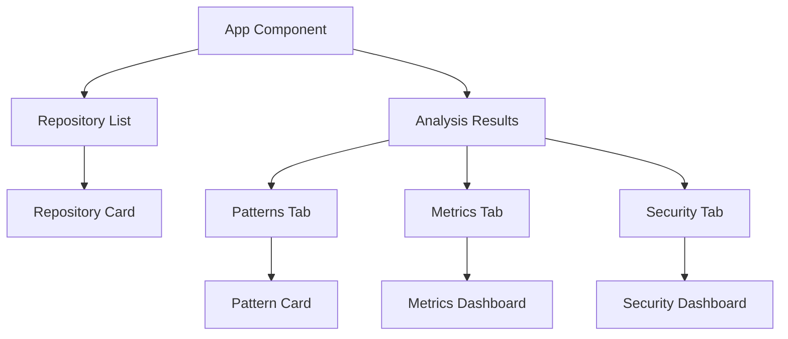

# RepoAnalyzer

A tool for analyzing code repositories and identifying common patterns.

## Table of Contents

1. [Recent Updates](#recent-updates)
2. [Project Structure](#project-structure)
3. [Configuration](#configuration)
4. [Key Features](#key-features)
5. [Error Handling](#error-handling)
6. [Performance](#performance)
7. [Testing](#testing)
8. [Type System](#type-system)
9. [Development](#development)
10. [Next Steps](#next-steps)
11. [Migration Guide](#migration-guide)
12. [Contributing](#contributing)
13. [License](#license)
14. [Prototype Development Plan](#prototype-development-plan)
15. [Comprehensive Testing Plan](#comprehensive-testing-plan)
16. [UI-First Development Plan](#ui-first-development-plan)
17. [AI Analysis Testing Infrastructure](#ai-analysis-testing-infrastructure)

## Recent Updates

### Enhanced Repository Analysis Interface (2025-02-19)

#### New Features
1. Repository Management
   - Advanced filtering system by name, description, and tags
   - Sorting capabilities (stars, forks, contributors, last analyzed)
   - Status filtering (analyzed, analyzing, error)
   - Language filtering (Python, Go, TypeScript, C++)
   - Enhanced repository cards with metrics display

2. Analysis Results
   - Pattern categorization and filtering
   - Interactive performance metrics visualization
   - Security analysis with compliance scores
   - Code quality metrics dashboard
   - Resource usage monitoring
   - Latency trend visualization

3. Mock Data Structure
   ```typescript
   // Example Repository Structure
   interface Repository {
     id: string;
     name: string;
     description: string;
     status: 'analyzed' | 'analyzing' | 'error';
     stats: {
       stars: number;
       forks: number;
       contributors: number;
     };
     language: string;
     tags: string[];
   }
   ```

4. Dependencies
   ```json
   {
     "dependencies": {
       "@radix-ui/react-dialog": "^1.0.5",
       "@radix-ui/react-dropdown-menu": "^2.0.6",
       "@radix-ui/react-tabs": "^1.0.4",
       "react": "^18.2.0",
       "react-dom": "^18.2.0",
       "tailwindcss": "^3.4.1"
     }
   }
   ```

### File Structure

```
frontend/
├── src/
│   ├── App.tsx              # Main application component
│   ├── mocks/
│   │   └── mockData.ts      # Mock data for development
│   └── components/          # UI components
├── .eslintrc.cjs           # ESLint configuration
└── package.json            # Project dependencies
```

### Component Flow


### Error Handling
- Status indicators for repository analysis state
- Error boundaries for component failures
- Graceful degradation for missing data
- Loading states for async operations

### Performance Considerations
- Memoized repository filtering and sorting
- Lazy loading of analysis tabs
- Efficient rendering of large datasets
- Optimized chart updates

## Next Steps

1. Testing
   - Add unit tests for new components
   - Implement integration tests for filtering and sorting
   - Add performance benchmarks
   - Test edge cases in data visualization

2. Features
   - Implement real-time analysis updates
   - Add batch repository processing
   - Enhance search capabilities
   - Add export functionality for analysis results

3. UI/UX
   - Add responsive design for mobile
   - Implement dark mode
   - Add keyboard shortcuts
   - Improve accessibility

4. Documentation
   - Add component API documentation
   - Update TypeScript interfaces
   - Document state management patterns
   - Add usage examples

## Component Organization (February 15, 2025)

#### Component Directory Structure

```
src/
├── components/
│   ├── analysis/       # Analysis-related components
│   ├── category/       # Category management components
│   ├── debug/          # Debugging and development tools
│   ├── search/         # Search interface components
│   ├── ui/            # Core UI components
│   └── visualization/ # Data visualization components
```

#### Component Categories

1. **Analysis Components**

   - `AnalysisChart`: Displays code quality metrics
   - `AnalysisMetrics`: Shows detailed analysis data
   - `AnalysisResults`: Presents analysis findings

2. **Category Components**

   - `CategoryList`: Displays available categories
   - `CategoryFilter`: Filters content by category
   - `CategoryMetrics`: Shows category-specific metrics

3. **Debug Components**

   - `SearchDebug`: Debug interface for search functionality
   - `ErrorMetrics`: Displays error tracking information
   - `DebugPanel`: Main debugging interface

4. **Search Components**

   - `SearchInterface`: Main search UI component
   - `FuzzyMatchVisualizer`: Visualizes fuzzy match results
   - `SearchResults`: Displays search results

5. **UI Components**

   - `Button`: Reusable button component
   - `Input`: Form input components
   - `Modal`: Dialog and modal components

6. **Visualization Components**
   - `DistributionChart`: Shows data distribution
   - `Timeline`: Displays temporal data
   - `MetricsChart`: Visualizes metrics data
   - `DependencyGraph`: Shows code dependencies

#### Mock Component Organization

All mock components are organized in `src/__tests__/test-utils/mocks/components/` with the following structure:

```
mocks/
├── components/
│   ├── analysis/
│   │   └── index.tsx      # Analysis component mocks
│   ├── category/
│   │   └── index.tsx      # Category component mocks
│   ├── debug/
│   │   └── index.tsx      # Debug component mocks
│   ├── search/
│   │   └── index.tsx      # Search component mocks
│   ├── ui/
│   │   └── index.tsx      # UI component mocks
│   └── visualization/
│       └── index.tsx      # Visualization component mocks
└── data/
    ├── analysis/
    │   └── index.ts       # Analysis mock data
    ├── category/
    │   └── index.ts       # Category mock data
    └── search/
        └── index.ts       # Search mock data
```

#### Testing Guidelines

1. **Mock Organization**

   - Keep ALL mocks in `src/__tests__/test-utils/mocks/`
   - Separate by component type (analysis, category, etc.)
   - Export through index.ts files
   - Use TypeScript for type safety

2. **Component Testing**

   - Import mocks from central locations
   - Test success and error cases
   - Verify rendered content
   - Test state changes
   - Use ARIA roles/labels

3. **Best Practices**
   - No duplicate mock implementations
   - No inline mock data
   - No mixed test types
   - No implementation details
   - No hardcoded test data

## Testing Improvements (February 14, 2025)

#### SearchComparison Component Tests

The SearchComparison component tests have been enhanced with the following improvements:

1. **Mock Export Function Organization**

   - Centralized mock functions in `src/__tests__/test-utils/mocks/search-components.tsx`
   - Export mock functions for reuse across test files
   - ```typescript
     // search-components.tsx
     export const mockExportToJSON = vi.fn();
     ```

   ```

   ```

2. **Component Test Coverage**

   - Selection controls and state management
   - View mode switching (grid/list)
   - Export functionality with proper data structure
   - Fuzzy match highlighting
   - Empty state handling

3. **Export Functionality Testing**

```typescript
// search-components.tsx
vi.mock('@/lib/export', () => ({
  exportToJSON: mockExportToJSON,
  exportToMarkdown: vi.fn(),
}));

it('exports selected results', () => {
  // Test verifies:
  // - Export button state (enabled/disabled)
  // - Export function called with correct data
  // - Proper data structure for export
});
```

4. **Best Practices Implemented**
   - Clear test descriptions
   - Proper mock cleanup between tests
   - Consistent test data structure
   - Comprehensive assertions
   - Reusable mock functions

## Analysis Component Updates (February 15, 2025)

#### AnalysisChart Component

The AnalysisChart component has been implemented with the following features:

1. **Core Functionality**

   - Displays code quality metrics with scores
   - Shows detected design patterns and their frequency
   - Uses grid layout for responsive display
   - Handles loading and error states

2. **API Integration**

   - Uses `analysisService.ts` for data fetching
   - Supports both repository URL and analysis ID
   - Proper error handling with `AnalysisError` class
   - Consistent error messages across components

3. **Component Structure**

```
src/
├── components/
│   └── analysis/
│       └── AnalysisChart.tsx    # Main chart component
├── services/
│   └── analysisService.ts       # API service for analysis data
└── hooks/
    └── useAnalysis.ts           # Data fetching hook
```

4. **Testing Infrastructure**

   - Component tests in `cypress/component/AnalysisChart.cy.tsx`
   - Uses centralized mocks from `src/__tests__/test-utils/mocks/`
   - Mock data in `analysis.ts`, `api.ts`, and `errors.ts`
   - Tests core functionality, loading, and error states
   - Accessibility and mobile tests prepared (currently skipped)

5. **Development Status**

   - Core functionality implemented
   - API integration complete
   - Basic test coverage
   - Mobile interactions (TODO)
   - Accessibility improvements (TODO)

6. **Next Steps**
   - Implement mobile-specific interactions
   - Add accessibility features
   - Enhance error handling with retry logic
   - Add performance monitoring
   - Implement caching for analysis results

## Loading State Implementation (February 15, 2025)

#### New Components

1. `AnalysisChartSkeleton.tsx`:
   - Provides loading placeholder UI
   - Uses Tailwind's animate-pulse for loading animation
   - Matches final layout to prevent layout shifts
   - Dark mode compatible with dark: classes

#### Component Updates

1. `AnalysisChart.tsx`:
   - Now uses AnalysisChartSkeleton for loading state
   - Improved loading state transitions
   - Better error handling structure

#### Test Structure

1. Core Test Cases:

```typescript
// Loading State
it('handles loading state', () => {
  // Tests skeleton UI visibility
  // Tests placeholder structure
  // Tests transition to loaded state
});

// Error State
it('handles error state', () => {
  // Tests error message display
  // Tests error message content
});

// Data Display
it('displays chart with correct data', () => {
  // Tests metrics display
  // Tests pattern display
});
```

2. Mobile & Accessibility Tests (Prepared):
   - Mobile interaction tests (currently skipped)
   - Accessibility tests (currently skipped)
   - Will be enabled after core functionality is complete

#### Next Steps

1. Error Handling:

   - Add retry button
   - Implement exponential backoff
   - Add error boundary

2. Performance:
   - Add request debouncing
   - Implement request cancellation
   - Set up caching

## Mock Organization

Our mocks are organized in `src/__tests__/test-utils/mocks/` with the following structure:

```
mocks/
├── data/               # Data mocks
│   ├── analysis.ts    # Analysis result data
│   ├── errors.ts      # Error message data
│   ├── logs.ts        # Log entry data
│   ├── metrics.ts     # Metrics data
│   └── patterns.ts    # Pattern data
├── services/          # Service mocks
│   ├── api.ts        # API response mocks
│   └── router.ts     # Router service mocks
├── ui/               # UI component mocks
│   ├── icons.tsx    # Icon component mocks
│   └── search.tsx   # Search component mocks
└── index.ts         # Central export point
```

### Mock Types and Usage

1. **Data Mocks** (`/data`)

   - Mock data structures matching production interfaces
   - Factory functions for generating test data
   - Consistent with API response formats
   - Used in both component and integration tests

2. **Service Mocks** (`/services`)

   - `api.ts`: API response mocks and fetch mock
   - `router.ts`: Next.js router mocks
   - Used for mocking external dependencies
   - Consistent error handling patterns

3. **UI Mocks** (`/ui`)
   - `icons.tsx`: SVG icon component mocks
   - `search.tsx`: Search component mocks
   - Used for complex component dependencies
   - Maintain component interfaces

### Import Guidelines

```typescript
// Always import from the centralized location
import { mockAnalysisData } from '@test-utils/mocks/data/analysis';
import { mockRouter } from '@test-utils/mocks/services/router';
import { Icons } from '@test-utils/mocks/ui/icons';
```

### Mock Data Guidelines

1. Use TypeScript interfaces
2. Keep mock data minimal
3. Use factory functions
4. Document deviations
5. Maintain consistency

## Tech Stack

### Core

- **Frontend Framework**: React with TypeScript
- **UI Components**: Radix UI primitives with Tailwind CSS
- **State Management**: React Context + Hooks
- **Build Tool**: Vite
- **Package Manager**: pnpm

### Testing

- **Unit Testing**: Jest + React Testing Library
- **E2E Testing**: Cypress + Playwright
- **Test Runner**: Vitest

### Code Quality

- **Linting**: ESLint
- **Formatting**: Prettier
- **Type Checking**: TypeScript
- **Git Hooks**: Husky + lint-staged

## Testing

### Test Structure

The project's test files are organized in `src/__tests__/` with the following structure:

```
src/__tests__/
├── e2e/                 # End-to-end tests
│   ├── components/      # Component E2E tests
│   ├── hooks/          # Hook E2E tests
│   └── services/       # Service E2E tests
├── integration/         # Integration tests
│   ├── components/     # Component integration tests
│   ├── hooks/         # Hook integration tests
│   └── services/      # Service integration tests
├── performance/        # Performance tests
│   ├── components/    # Component performance tests
│   ├── hooks/        # Hook performance tests
│   └── services/     # Service performance tests
└── test-utils/        # Testing utilities
    ├── mocks/        # Reusable mocks
    └── render.tsx    # Custom render utilities
```

### Test Setup

The project uses Vitest as the test runner with React Testing Library. Key setup files:

- `src/__tests__/setup.ts`: Global test setup and configuration
- `src/__tests__/test-utils/render.tsx`: Custom render functions with providers
- `src/__tests__/test-utils/mocks/`: Shared mock implementations

### Running Tests

```bash
# Run all tests
pnpm test

# Run tests in watch mode
pnpm test:watch

# Run tests with coverage
pnpm test:coverage

# Run specific test file
pnpm test [test-file-pattern]

# Run tests in specific directory
pnpm test [directory-pattern]

# Run E2E tests
pnpm test:e2e

# Run performance tests
pnpm test:perf
```

### Testing Guidelines

### Frontend Testing

#### Event Testing

When testing React components that handle events (e.g., onChange, onFocus, onBlur), follow these guidelines:

1. **Use React Testing Library's Built-in Methods First**

   ```typescript
   import { render, screen, fireEvent } from '@testing-library/react';

   // Preferred approach
   fireEvent.change(input, { target: { value: 'test' } });
   fireEvent.focus(input);
   fireEvent.blur(input);
   ```

2. **For Complex User Interactions, Use `userEvent`**

   ```typescript
   import userEvent from '@testing-library/user-event';

   const user = userEvent.setup();
   await user.type(input, 'test');
   await user.tab();
   ```

3. **When Testing Event Handlers Directly, Use React Synthetic Events**

   ```typescript
   // Create a proper React synthetic event
   const syntheticEvent = {
     target: { value: 'test' },
     currentTarget: { value: 'test' },
     preventDefault: () => {},
     stopPropagation: () => {},
     nativeEvent: new Event('change'),
   } as React.ChangeEvent<HTMLInputElement>;

   // Call the handler directly
   handleChange(syntheticEvent);
   ```

4. **Avoid Native DOM Events**

   ```typescript
   // ❌ Don't use native DOM events
   const event = new Event('change');
   input.dispatchEvent(event);

   // ✅ Use React Testing Library's methods
   fireEvent.change(input, { target: { value: 'test' } });
   ```

#### Component Query Best Practices

1. **Query Priority (from most to least preferred)**:

   - `getByRole` - Most accessible and recommended
   - `getByLabelText` - Good for form fields
   - `getByPlaceholderText` - Acceptable for search fields
   - `getByText` - Good for buttons and headings
   - `getByTestId` - Last resort, use only when necessary

2. **Handle Hidden Elements**:

   ```typescript
   // For inputs that might be hidden (e.g., password fields)
   screen.getByRole('textbox', { hidden: true });
   ```

3. **Multiple Query Methods**:
   ```typescript
   // Use logical OR for flexible queries
   const input = screen.getByRole('textbox') || screen.getByDisplayValue('');
   ```

### Common Testing Patterns

#### Form Components

```typescript
describe('Form Component', () => {
  it('submits form data correctly', async () => {
    const handleSubmit = vi.fn();
    render(<Form onSubmit={handleSubmit} />);

    // Fill out form fields
    await userEvent.type(screen.getByLabelText('Username'), 'testuser');
    await userEvent.type(screen.getByLabelText('Password'), 'password123');

    // Submit form
    await userEvent.click(screen.getByRole('button', { name: /submit/i }));

    // Verify submission
    expect(handleSubmit).toHaveBeenCalledWith({
      username: 'testuser',
      password: 'password123'
    });
  });
});
```

#### Async Components

```typescript
describe('Async Component', () => {
  it('handles loading and success states', async () => {
    render(<AsyncComponent />);

    // Check loading state
    expect(screen.getByRole('progressbar')).toBeInTheDocument();

    // Wait for content
    await screen.findByRole('article');

    // Verify loading is done
    expect(screen.queryByRole('progressbar')).not.toBeInTheDocument();
  });
});
```

#### MetricCard Components

```typescript
describe('MetricCard Component', () => {
  it('displays metric value and label', () => {
    render(<MetricCard value={42} label="Test Metric" />);

    // Verify metric value
    expect(screen.getByText('42')).toBeInTheDocument();

    // Verify metric label
    expect(screen.getByText('Test Metric')).toBeInTheDocument();
  });
});
```

#### Tooltip Components

```typescript
describe('Component with Tooltip', () => {
  it('displays tooltip content on hover', async () => {
    // Set up userEvent for better interaction simulation
    const user = userEvent.setup();

    // Render component with necessary providers
    render(
      <TooltipProvider>
        <ComponentWithTooltip />
      </TooltipProvider>
    );

    // Find the tooltip trigger
    const trigger = screen.getByTestId('tooltip-trigger');

    // Simulate hover
    await user.hover(trigger);

    // Wait for and verify tooltip content
    await waitFor(() => {
      const tooltip = screen.getByTestId('tooltip-content');
      expect(tooltip).toHaveTextContent('Expected tooltip content');
    });
  });
});
```

Key points for testing tooltips:

1. Always wrap components with necessary providers (e.g., `TooltipProvider`)
2. Use `@testing-library/user-event` for hover interactions
3. Use `waitFor` to handle asynchronous tooltip rendering
4. Add appropriate test IDs to tooltip trigger and content
5. Consider portal rendering when testing tooltips

### Setting Up the Test Environment

1. Install dependencies:

```bash
pnpm install
```

2. Build the project:

```bash
pnpm build
```

### Running Tests

#### Quick Start

Run all tests:

```bash
pnpm test
```

#### Specific Test Types

1. Unit Tests:

```bash
# Run all unit tests
pnpm test:unit

# Run specific unit test file
pnpm test src/__tests__/unit/components/ui/Button.test.tsx

# Run tests in watch mode
pnpm test:watch
```

2. Component Tests:

```bash
# Run all component tests
pnpm test:components

# Run tests for specific component
pnpm test src/__tests__/unit/components/<ComponentName>.test.tsx
```

3. Integration Tests:

```bash
pnpm test:integration
```

4. E2E Tests:

```bash
pnpm test:e2e
```

### Test Coverage

Generate and view test coverage report:

```bash
# Generate coverage report
pnpm test:coverage

# Open coverage report in browser
pnpm test:coverage:open
```

### Writing Tests

#### Component Test Template

```typescript
import { describe, it, expect } from 'vitest';
import { render, screen } from '@test-utils/render';
import { ComponentName } from '@/components/path/to/Component';

describe('ComponentName', () => {
  it('renders successfully', () => {
    render(<ComponentName />);
    expect(screen.getByRole('button')).toBeInTheDocument();
  });

  it('handles user interactions', async () => {
    const { user } = render(<ComponentName />);
    const button = screen.getByRole('button');
    await user.click(button);
    // Add assertions
  });
});
```

#### Testing Utilities

1. Custom Render:

```typescript
import { render } from '@test-utils/render';

// Includes setup for:
// - Custom user event instance
// - Common provider wrappers
// - Vitest mocks
const { user } = render(<Component />);
```

2. Common Matchers:

```typescript
// DOM matchers
expect(element).toBeInTheDocument();
expect(element).toHaveClass('class-name');
expect(element).toHaveAttribute('attr', 'value');

// Event handlers
expect(handleClick).toHaveBeenCalledTimes(1);
```

### Test Organization

Tests are organized following a co-located structure:

```
src/
├── components/
│   └── ComponentName/
│       ├── ComponentName.tsx
│       ├── ComponentName.test.tsx
│       └── __snapshots__/
├── __tests__/
│   └── test-utils/
│       └── mocks/
│           ├── data/               # Mock data files
│           ├── ui.tsx             # UI component mocks
│           └── api.ts            # API endpoint mocks
└── types/
    ├── analysis.ts               # Analysis-related types
    └── errors.ts                # Error-related types

cypress/
├── component/                   # Component test files
│   ├── AnalysisChart.cy.tsx
│   └── ...
└── support/
    ├── commands.ts             # Custom Cypress commands
    └── test-utils.ts          # Test utility functions
```

### Best Practices

1. **Pattern Creation**

   - Use clear, descriptive names
   - Provide comprehensive examples
   - Include detailed documentation
   - Set appropriate weights
   - Test with various codebases
   - **Focus on adaptability and reuse**
   - **Document adaptation requirements**
   - **Provide generalization guidelines**

2. **Pattern Management**

   - Version patterns appropriately
   - Document changes
   - Validate before sharing
   - Monitor pattern effectiveness
   - Update based on feedback
   - **Track adaptation success rates**
   - **Collect adaptation feedback**
   - **Update adaptation guides**

3. **Pattern Detection**
   - Set appropriate confidence thresholds
   - Handle edge cases
   - Provide clear feedback
   - Monitor performance
   - Log detection issues
   - **Identify adaptation opportunities**
   - **Suggest pattern generalizations**
   - **Flag implementation-specific patterns**

### Features

### Repository Management

- View all repositories in a grid layout
- Search repositories by name or description
- Filter repositories by status (All/Starred/Archived)
- Quick access to repository analysis
- Visual indicators for repository status

### Analysis Features

- Code quality metrics visualization
- Pattern detection and analysis
- Hotspot identification
- Actionable suggestions
- Detailed pattern instances

## Next Steps

1. **Backend Integration**

   - [ ] Connect frontend to backend API
   - [ ] Implement proper error handling
   - [ ] Add retry logic for failed requests
   - [ ] Add request caching

2. **Authentication**

   - [ ] Add login/signup flow
   - [ ] Implement session management
   - [ ] Add protected routes
   - [ ] Handle token refresh

3. **Data Management**

   - [ ] Implement proper state management
   - [ ] Add data persistence
   - [ ] Handle offline mode
   - [ ] Add data sync

4. **User Experience**

   - [ ] Add loading indicators
   - [ ] Improve error messages
   - [ ] Add success notifications
   - [ ] Implement undo/redo

5. **Testing**

   - [ ] Add end-to-end tests
   - [ ] Add integration tests
   - [ ] Add performance tests
   - [ ] Add API mocking

6. **Deployment**

   - [ ] Setup CI/CD pipeline
   - [ ] Add environment configurations
   - [ ] Setup monitoring
   - [ ] Add logging

7. **Documentation**
   - [ ] Add API documentation
   - [ ] Add setup instructions
   - [ ] Add deployment guide
   - [ ] Add contribution guide

## Current Status

1. **Completed Features**

   - Basic component structure
   - Component unit tests
   - Performance optimizations
   - Error handling
   - Loading states
   - Data sorting and filtering
   - Pagination

2. **In Progress**

   - Backend integration
   - Authentication flow
   - State management
   - End-to-end testing

3. **Upcoming**
   - Deployment setup
   - CI/CD pipeline
   - Documentation
   - Performance monitoring

## Prototype Development Plan {#prototype-development-plan}

### Current Priority: Frontend Prototype with Mock Data

#### Phase 1: Core UI Components 

1. **Update Project Structure**

   ```
   src/
   ├── components/
   │   ├── repository/           # New directory
   │   │   ├── RepositoryForm.tsx
   │   │   ├── RepositoryList.tsx
   │   │   └── RepositoryCard.tsx
   │   ├── navigation/          # New directory
   │   │   ├── MainNav.tsx
   │   │   └── NavLink.tsx
   │   └── layout/             # Existing
   │       └── MainLayout.tsx  # Update with navigation
   ```

2. **Component Implementation Order**

   a. **RepositoryForm** (`src/components/repository/RepositoryForm.tsx`)

   ```typescript
   interface RepositoryFormProps {
     onSubmit: (url: string) => void;
     isLoading?: boolean;
   }
   ```

   - URL validation regex: `/^https?:\/\/(github\.com|gitlab\.com|bitbucket\.org)\/[\w-]+\/[\w-]+$/`
   - Error states: Invalid URL, Empty URL
   - Loading state during submission

   b. **RepositoryList** (`src/components/repository/RepositoryList.tsx`)

   ```typescript
   interface RepositoryListProps {
     repositories: Repository[];
     onSelect: (id: string) => void;
   }
   ```

   - Use existing Card component
   - Add status badges
   - Add last analyzed time

   c. **Navigation** (`src/components/navigation/MainNav.tsx`)

   ```typescript
   interface NavItem {
     path: string;
     label: string;
     icon: React.ReactNode;
   }
   ```

   - Home (Repository List)
   - Analysis Dashboard
   - Settings (placeholder)

   d. **Analysis Results View** (Update existing `AnalysisDashboard.tsx`)

   - Add repository metadata
   - Integrate with AnalysisChart
   - Add filtering controls

#### Phase 2: Mock Data Layer 

1. **Mock Data Structure** (`src/__tests__/test-utils/mocks/data/`)

   ```
   data/
   ├── repositories.ts      # Repository list data
   ├── analysis.ts         # Analysis results (existing)
   ├── progress.ts         # Analysis progress states
   └── errors.ts          # Error state examples
   ```

2. **Type Definitions** (`src/types/`)

   ```typescript
   // repository.ts
   interface Repository {
     id: string;
     url: string;
     name: string;
     status: 'pending' | 'running' | 'completed' | 'error';
     lastAnalyzed?: string;
     metrics?: AnalysisMetrics;
     error?: {
       code: string;
       message: string;
       details?: unknown;
     };
   }

   // progress.ts
   interface AnalysisProgress {
     repositoryId: string;
     status: 'pending' | 'running' | 'completed' | 'error';
     progress: number;
     currentTask?: string;
     remainingTime: number;
     startTime: string;
     endTime?: string;
   }
   ```

3. **Mock Data Examples**
   ```typescript
   // Mock repositories
   export const mockRepositories: Repository[] = [
     {
       id: '1',
       url: 'https://github.com/facebook/react',
       name: 'react',
       status: 'completed',
       lastAnalyzed: '2025-02-17T12:00:00Z',
       metrics: mockAnalysisMetrics, // existing
     },
     {
       id: '2',
       url: 'https://github.com/vercel/next.js',
       name: 'next.js',
       status: 'running',
       progress: 45,
     },
   ];
   ```

#### Phase 3: User Flow Implementation 

1. **Repository Management Flow**

   ```typescript
   // src/hooks/useRepositoryManagement.ts
   interface UseRepositoryManagement {
     repositories: Repository[];
     addRepository: (url: string) => Promise<void>;
     removeRepository: (id: string) => Promise<void>;
     getRepository: (id: string) => Repository | undefined;
   }
   ```

2. **Analysis Flow**

   ```typescript
   // src/hooks/useAnalysisFlow.ts
   interface UseAnalysisFlow {
     startAnalysis: (repoId: string) => Promise<void>;
     cancelAnalysis: (repoId: string) => Promise<void>;
     getProgress: (repoId: string) => AnalysisProgress;
     getResults: (repoId: string) => AnalysisResult | undefined;
   }
   ```

3. **Progress Tracking**
   - Use existing AnalysisProgress component
   - Add progress notifications
   - Implement cancel functionality

#### Phase 4: Polish and Refinement 

1. **Loading States**
   - Use existing LoadingProvider
   - Add Skeleton components for:
     - Repository list
     - Analysis dashboard
     - Charts
2. **Error Handling**

   - Use existing ErrorBoundary
   - Add error states for:
     - Invalid repository
     - Analysis failure
     - Network issues

3. **Styling**
   - Use existing Tailwind classes
   - Ensure dark mode support
   - Add responsive layouts
   - Add transitions

### Success Metrics

1. **User Experience**
   - Clear understanding of repository objectives
   - Easy pattern discovery and saving
   - Intuitive navigation between views
   - Seamless knowledge capture

2. **Knowledge Quality**
   - Accurate objective analysis
   - Relevant pattern identification
   - Clear implementation context
   - Useful code references

3. **System Performance**
   - Quick initial analysis
   - Responsive UI interactions
   - Fast pattern search
   - Smooth transitions

### Non-Goals for This Phase

- Advanced performance optimization
- Complex visualizations
- Extensive error handling
- Accessibility features
- Complex state management
- Comprehensive testing

### Critical File Management Rules

1. **Before Creating Any New File**
   ```bash
   # ALWAYS run these checks first
   find frontend/src -type f -name "*${ComponentName}*.tsx"  # Check for similar names
   find frontend/src -type f -name "*${Feature}*.tsx"    # Check for similar names
   find frontend/src -type f -name "*${Pattern}*.tsx"     # Check for similar names
   ```

2. **File Location & Naming**
   - Follow existing patterns EXACTLY:
     ```
     components/
     ├── analysis/
     │   ├── input/              # Input-related components
     │   │   └── *Input.tsx     # Must end with "Input"
     │   ├── results/           # Results-related components
     │   │   └── *Results.tsx   # Must end with "Results"
     │   └── core/             # Core analysis components
     │       └── *Core.tsx     # Must end with "Core"
     └── patterns/
         ├── explorer/         # Pattern exploration
         │   └── *Explorer.tsx # Must end with "Explorer"
         └── details/         # Pattern details
             └── *Details.tsx # Must end with "Details"
     ```

3. **Dependencies Check**
   ```typescript
   // ALWAYS check these dependencies when modifying components
   import type { Dependencies } from '@/types';
   
   interface ComponentDependencies {
     // UI Components
     radixUI: {
       dialog?: boolean;
       tabs?: boolean;
       toast?: boolean;
       // ... check package.json for full list
     };
     
     // Styling
     tailwind: {
       classes: string[];
       utilities: string[];
     };
     
     // State Management
     hooks: {
       name: string;
       purpose: string;
     }[];
     
     // Types
     types: {
       path: string;
       interface: string;
     }[];
   }
   ```

4. **File Movement Protocol**
   ```bash
   # When moving files:
   1. Check all imports in the file
   2. Find all files importing this file
   3. Update all related test files
   4. Update any storybook stories
   5. Update any related mock data
   

```

### Critical File Management Rules

1. **Existing File Patterns**
   ```
   frontend/src/
   ├── components/
   │   ├── analysis/
   │   │   ├── core/                      # Core analysis functionality
   │   │   │   ├── AnalysisFilters.tsx    # Pattern: Component + Purpose
   │   │   │   ├── AnalysisMetricsCard.tsx
   │   │   │   ├── AnalysisSummaryCard.tsx
   │   │   │   └── AnalysisTable.tsx
   │   │   ├── input/                     # Input handling
   │   │   │   ├── AnalysisProgress.tsx   # Pattern: Component + Purpose
   │   │   │   └── RepositoryEntryPoint.tsx
   │   │   ├── results/                   # Results display
   │   │   │   ├── AnalysisResults.tsx    # Pattern: Component + Purpose
   │   │   │   └── RepositoryAnalysis.tsx
   │   │   └── tabs/                      # Tab components
   │   │       ├── ChatTab.tsx           # Pattern: Purpose + Tab
   │   │       └── FileExplorerTab.tsx
   │   └── patterns/
   │       ├── explorer/                  # Pattern exploration
   │       │   ├── PatternExplorer.tsx   # Pattern: Component + Purpose
   │       │   └── PatternGrid.tsx
   │       └── shared/                    # Shared components
   │           ├── PatternBadge.tsx      # Pattern: Component + Type
   │           └── PatternCard.tsx
   ├── hooks/                            # Custom hooks
   │   ├── useAnalysis.ts               # Pattern: use + Feature
   │   ├── usePattern.ts
   │   └── useRepository.ts
   └── types/                           # Type definitions
       ├── analysis.ts                  # Pattern: feature.ts
       ├── patterns.ts
       └── repository.ts
   ```

2. **Naming Conventions**
   ```typescript
   // Components
   interface ComponentNaming {
     prefix: {
       analysis: 'Analysis' | 'Repository';  // For analysis-related components
       pattern: 'Pattern';                   // For pattern-related components
       shared: 'Shared';                     // For shared components
     };
     suffix: {
       container: 'View' | 'Container';      // For container components
       ui: 'Card' | 'Grid' | 'List';        // For UI components
       input: 'Input' | 'Form';             // For input components
       display: 'Display' | 'View';         // For display components
     };
   }

   // Hooks
   interface HookNaming {
     prefix: 'use';                        // All hooks must start with 'use'
     feature: string;                      // The main feature (Analysis, Pattern, etc.)
     action?: string;                      // Optional action (Search, Update, etc.)
   }
   ```

3. **Dependency Tracking**
   ```typescript
   interface ComponentDependencies {
     // Component Relationships
     relationships: {
       parents: string[];      // Direct parent components
       children: string[];     // Required children
       siblings: string[];     // Related components
     };

     // Feature Dependencies
     features: {
       required: Array<{
         name: string;
         reason: string;
       }>;
       optional: Array<{
         name: string;
         fallback?: string;
       }>;
     };

     // Data Flow
     data: {
       inputs: Array<{
         name: string;
         type: string;
         required: boolean;
       }>;
       outputs: Array<{
         name: string;
         consumers: string[];
       }>;
     };

     // Styling
     styling: {
       tailwind: {
         required: string[];
         variants: Record<string, string[]>;
       };
       customCSS: string[];
     };

     // Performance
     performance: {
       expensive: boolean;
       optimizations: string[];
       monitoring: string[];
     };
   }
   ```

4. **File Operation Checklist**
   ```bash
   # 1. Pre-Creation Checks
   find frontend/src -type f -name "*${ComponentName}*.tsx"  # Check similar names
   grep -r "import.*${ComponentName}" .                      # Check imports
   npm list | grep "${Dependency}"                          # Check dependencies

   # 2. Creation Process
   - Use appropriate template
   - Place in correct directory
   - Add required dependencies
   - Create test files

   # 3. Post-Creation Validation
   - Run linting
   - Check imports
   - Verify dependencies
   - Update documentation
   ```

### Component Pattern Examples

```typescript
// 1. Container Components (AnalysisView.tsx)
interface AnalysisViewProps {
  repository: Repository;
  onAnalysisComplete: (results: AnalysisResults) => void;
}

// 2. Feature Components (PatternExplorer.tsx)
interface PatternExplorerProps {
  patterns: Pattern[];
  onPatternSelect: (pattern: Pattern) => void;
}

// 3. Shared Components (PatternCard.tsx)
interface PatternCardProps {
  pattern: Pattern;
  variant: 'default' | 'compact' | 'detailed';
}

// 4. Layout Components (AnalysisLayout.tsx)
interface AnalysisLayoutProps {
  sidebar?: React.ReactNode;
  content: React.ReactNode;
  footer?: React.ReactNode;
}
```

### Enhanced Dependency Tracking

```typescript
interface ExtendedDependencies {
  // Component Relationships
  relationships: {
    parents: string[];      // Direct parent components
    children: string[];     // Required children
    siblings: string[];     // Related components
  };

  // Feature Dependencies
  features: {
    required: Array<{
      name: string;
      reason: string;
    }>;
    optional: Array<{
      name: string;
      fallback?: string;
    }>;
  };

  // Data Flow
  data: {
    inputs: Array<{
      name: string;
      type: string;
      required: boolean;
    }>;
    outputs: Array<{
      name: string;
      consumers: string[];
    }>;
  };

  // Styling
  styling: {
    tailwind: {
      required: string[];
      variants: Record<string, string[]>;
    };
    customCSS: string[];
  };

  // Performance
  performance: {
    expensive: boolean;
    optimizations: string[];
    monitoring: string[];
  };
}
```

### File Operation Protocol

```bash
# 1. Pre-Creation Checks
find frontend/src -type f -name "*${ComponentName}*.tsx"  # Check similar names
grep -r "import.*${ComponentName}" .                      # Check imports
npm list | grep "${Dependency}"                          # Check dependencies

# 2. Creation Process
- Use appropriate template
- Place in correct directory
- Add required dependencies
- Create test files

# 3. Post-Creation Validation
- Run linting
- Check imports
- Verify dependencies
- Update documentation

```

## AI Analysis Testing Infrastructure

The project includes a comprehensive testing infrastructure for AI analysis components:

```typescript
// Mock Data Structure
src/__tests__/test-utils/mocks/data/ai/
├── types.ts              # Shared type definitions and interfaces
├── aiComponents.ts       # Component mock factories and scenarios
├── aiPatterns.ts        # Pattern mock factories and scenarios
├── aiInsights.ts        # Insight mock factories and scenarios
└── aiMetrics.ts         # Metrics mock factories and scenarios
```

#### Mock Data Factories

Each mock data file provides:
- Factory function for creating individual mocks
- Utility for creating multiple mocks
- Pre-defined test scenarios
- Type-safe mock creation with TypeScript

Example usage:
```typescript
import { 
  createAIComponent,
  createAIComponents,
  mockAIComponents
} from '@/test-utils/mocks/data/ai';

// Create single mock
const component = createAIComponent({
  name: 'CustomComponent',
  metrics: { complexity: 85 }
});

// Create multiple mocks
const components = createAIComponents(3);

// Use pre-defined scenario
const highQualityComponent = mockAIComponents.highQuality;
```

#### Test Utilities

```typescript
src/__tests__/test-utils/helpers/
├── aiTestHelpers.ts         # Type guards and assertions
└── mountWithAIProviders.tsx # Test-specific providers
```

##### Type Guards and Assertions
```typescript
import { isAIComponent, assertValidMetrics } from '@/test-utils/helpers/aiTestHelpers';

// Type checking
if (isAIComponent(result)) {
  // TypeScript knows result is AIComponent
}

// Metric validation
assertValidMetrics(metrics); // Throws if invalid
```

##### Component Testing
```typescript
import { renderWithAIProviders } from '@/test-utils/helpers/mountWithAIProviders';

describe('AIComponent', () => {
  it('renders with context', () => {
    renderWithAIProviders(<AIComponent />);
  });
});

```

## Testing UI Components

### Radix UI Component Testing

When testing components that use Radix UI primitives, follow these guidelines:

1. **Mock Implementation**
   ```typescript
   // Mock Dialog components
   vi.mock('@radix-ui/react-dialog', () => ({
     Root: ({ children }: any) => <div>{children}</div>,
     Trigger: ({ children }: any) => <button>{children}</button>,
     Portal: ({ children }: any) => <div>{children}</div>,
     Overlay: ({ children }: any) => <div>{children}</div>,
     Content: ({ children }: any) => <div>{children}</div>,
     Title: ({ children }: any) => <h2>{children}</h2>,
     Description: ({ children }: any) => <p>{children}</p>,
     Close: ({ children }: any) => <button>{children}</button>,
   }));

   // Mock Tooltip components
   vi.mock('@radix-ui/react-tooltip', () => ({
     Provider: ({ children }: any) => <div>{children}</div>,
     Root: ({ children }: any) => <div>{children}</div>,
     Trigger: ({ children }: any) => <button>{children}</button>,
     Portal: ({ children }: any) => <div>{children}</div>,
     Content: ({ children }: any) => <div data-testid="tooltip-content">{children}</div>,
   }));
   ```

2. **Common Gotchas**
   - Always mock ALL exports from a Radix UI package
   - Include `Close` component in Dialog mocks
   - Mock both the Provider and Root components
   - Add data-testid to Content components for easier testing

3. **Testing Multiple Elements**
   ```typescript
   // When elements appear multiple times (e.g., in labels and ARIA), use getAllByText
   expect(screen.getAllByText('Label Text')[0]).toBeInTheDocument();
   ```

### Empty State Testing

Components should handle empty states gracefully. Follow these patterns:

1. **Implementation Pattern**
   ```typescript
   {items.length > 0 ? (
     items.map((item) => <ItemCard key={item.id} item={item} />)
   ) : (
     <div className="col-span-2 text-center p-8 text-muted-foreground">
       No items found
     </div>
   )}
   ```

2. **Test Cases**
   ```typescript
   describe('Component with empty state', () => {
     it('shows empty message when no items exist', () => {
       render(<Component items={[]} />);
       expect(screen.getByText('No items found')).toBeInTheDocument();
     });

     it('renders items when they exist', () => {
       render(<Component items={mockItems} />);
       expect(screen.queryByText('No items found')).not.toBeInTheDocument();
       expect(screen.getAllByTestId('item-card')).toHaveLength(mockItems.length);
     });
   });
   ```

3. **Empty State Guidelines**
   - Always provide a meaningful message
   - Use consistent styling across empty states
   - Include data-testid attributes for testing
   - Consider adding helper actions or guidance

### Test Data Management

1. **Mock Data Structure**
   ```typescript
   // src/__tests__/test-utils/mocks/data/ai/
   export const mockAIMetrics = {
     modelComplexity: 85,
     serviceIntegration: 92,
     errorHandling: 88,
     testCoverage: 90,
     documentation: 87,
   };
   ```

2. **Mock Data Guidelines**
   - Store mock data in dedicated files
   - Use TypeScript interfaces for type safety
   - Include realistic values
   - Cover edge cases and boundary conditions

### Component Testing Best Practices

1. **Test Setup**
   - Use beforeEach for common setup
   - Mock external dependencies consistently
   - Reset mocks between tests
   - Use test-specific data-testid attributes

2. **Assertions**
   - Test component behavior, not implementation
   - Verify empty states and loading states
   - Check accessibility attributes
   - Test error handling and edge cases

3. **Common Patterns**
   ```typescript
   describe('ComponentName', () => {
     beforeEach(() => {
       // Reset mocks and common setup
     });

     it('handles empty state', () => {
       // Empty state test
     });

     it('displays loading state', () => {
       // Loading state test
     });

     it('renders error message', () => {
       // Error state test
     });

     it('displays content when data exists', () => {
       // Success state test
     });
   });
   ```

```
