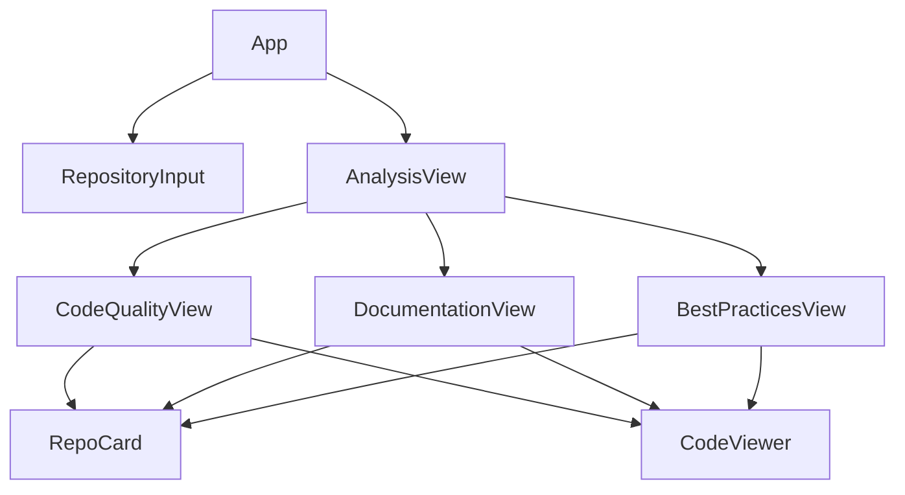
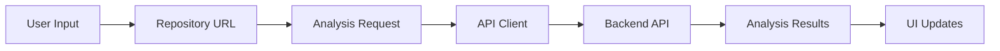

# Repository Analyzer

A powerful knowledge management platform that analyzes GitHub repositories for code quality, documentation, and best practices. The platform extracts key, reusable code sections—termed "business outcomes" or "skills"—which represent important building blocks for future development.

## Version and Release Notes

Current Version: 0.1.0

### Latest Changes (2025-02-05)

- Cleaned up Layout Components
  - Consolidated duplicate components
  - Removed: AppShellLayout, MainHeader, MainNavbar, AppNavbar
  - Standardized on: AppShell, Header, Sidebar, ErrorBoundary
  - Consistent styling with Tailwind CSS
  - Improved component organization
- Improved Project Structure
  - Removed duplicate README files
  - Consolidated documentation
  - Updated component exports
  - Cleaner imports
- Implemented Custom UI Component System
  - Built on Radix UI primitives for accessibility
  - Styled with Tailwind CSS for consistent design
  - Dark mode support out of the box
  - Type-safe components with TypeScript
  - Proper component organization with barrel files
- Enhanced UI Components
  - Button: Versatile button component with variants
  - Card: Flexible card layout with header/footer
  - Dialog: Modal dialogs with animations
  - Input: Form inputs with validation states
  - Select: Accessible dropdown select
  - Checkbox: Interactive checkbox component
  - Progress: Progress indicators
  - Toast: Notification system
  - Badge: Status indicators
  - ScrollArea: Custom scrollbars
  - DropdownMenu: Complex menu systems
- Improved Project Structure
  - Path aliases for cleaner imports
  - Barrel files for component exports
  - Consistent file organization
  - Enhanced type safety
- Added comprehensive component documentation
- Implemented modern design system
- Fixed component accessibility issues
- Added animation and transition support

## Project Status

### 1. Core Infrastructure [IN PROGRESS]

- [x] Project structure setup
- [x] FastAPI backend with async support
- [x] Pattern detection service
- [x] Database integration with SQLAlchemy
- [x] Environment configuration
- [x] API endpoint testing
- [ ] Complete API documentation
- [ ] Frontend development

### 2. Pattern Detection Features [IN PROGRESS]

- [x] AST-based code analysis
- [x] Pattern confidence scoring
- [x] Pattern relationship tracking
- [x] Context-aware analysis
- [x] Input validation and error handling
- [ ] Additional pattern support
- [ ] Pattern visualization

## Known Limitations

1. **Pattern Detection**

   - Currently supports only Python files
   - Limited to basic design patterns (Factory, Singleton, Observer)
   - Pattern confidence scoring may need manual verification
   - Large files (>10k LOC) may impact performance

2. **Analysis Features**

   - Code quality metrics are basic (complexity, lines of code)
   - Documentation analysis is limited to docstring presence
   - No support for custom pattern definitions
   - Performance may degrade with repositories >1GB

3. **Frontend Features**
   - Basic visualization capabilities
   - Limited real-time updates
   - No offline support
   - Mobile view is not optimized

## UI/UX Design Plan

### 1. Layout Structure

#### 1.1 Overall Layout (AppShell)

The application uses a custom AppShell component for consistent layout:

- **Header Component** (`Header.tsx`)
  - Height: 60px
  - Contains: Logo, toggle button, and user controls
  - Responsive design with mobile support

- **Sidebar Component** (`Sidebar.tsx`)
  - Width: 300px (collapsible on mobile)
  - Contains: Navigation links with icons
  - Sections:
    - Home (`/`)
    - Saved Repositories (`/saved-repos`)
    - Best Practices (`/best-practices`)
    - Chat (`/chat`)
    - Settings (`/settings`)

- **Main Content Area**
  - Rendered via React Router
  - Proper padding and spacing
  - Responsive to sidebar state

#### 1.2 Component Architecture

- **AppShell**
  ```typescript
  interface AppShellProps {
    children: React.ReactNode;
  }
  ```
  - Manages layout state (opened/closed)
  - Handles responsive behavior
  - Provides consistent padding and spacing

- **Header**
  ```typescript
  interface HeaderProps {
    logo: React.ReactNode;
    toggleButton: React.ReactNode;
    userControls: React.ReactNode;
  }
  ```
  - Uses Radix UI primitives for custom styling
  - Icon-based navigation with active state
  - CSS modules for styling isolation

#### 1.3 Styling and Theme

- Using Tailwind CSS for styling
- CSS modules for component-specific styles
- Responsive breakpoints:
  - Mobile: < 768px (collapsed sidebar)
  - Tablet: 768px - 992px
  - Desktop: > 992px

### 2. Implementation Notes

#### 2.1 Fixed Issues

1. **AppShell Props**
   - Removed invalid `opened` boolean prop from div element
   - State management moved to internal component logic
   - Fixed prop type warnings

2. **Navigation State**
   - Proper state management using React Router
   - Active route highlighting
   - Smooth transitions between routes

3. **Component Organization**
   - Layout components in `src/components/layout/`
   - Page components in `src/pages/`
   - Shared components in `src/components/shared/`

#### 2.2 Future Improvements

- Add loading states for route transitions
- Implement proper error boundaries
- Add animations for sidebar collapse/expand
- Enhance mobile navigation experience
- Add breadcrumbs for deep navigation

### 3. Component Organization

```
frontend/
├── src/
│   ├── components/
│   │   ├── common/
│   │   │   ├── ui/           # Reusable UI components
│   │   │   │   ├── button.tsx
│   │   │   │   ├── card.tsx
│   │   │   │   └── index.ts  # Barrel file
│   │   │   └── index.ts      # Barrel file
│   │   ├── repository/       # Repository-specific components
│   │   └── layout/          # Layout components
│   ├── lib/
│   │   └── utils.ts         # Shared utilities
│   ├── styles/
│   │   └── globals.css      # Global styles and design tokens
│   └── pages/              # Page components
└── package.json
```

### Import Conventions

We use path aliases and barrel files to keep imports clean and maintainable:

```typescript
// ✅ Good: Using path aliases and barrel files
import { Button, Card } from "@/components/common/ui";
import { cn } from "@/lib/utils";

// ❌ Bad: Direct imports without aliases
import { Button } from "../../components/common/ui/button";
import { cn } from "../../../lib/utils";
```

### UI Component System

Our UI components are built with:
- Radix UI primitives for accessibility
- Tailwind CSS for styling
- TypeScript for type safety
- Class Variance Authority for variants

Example usage:

```typescript
import { Button } from "@/components/common/ui";

// Basic button
<Button>Click me</Button>

// Button with variant
<Button variant="destructive">Delete</Button>

// Button with custom class
<Button className="w-full">Full width</Button>
```

### Design System

Our design system uses CSS variables for theming:

```css
:root {
  --background: 0 0% 100%;
  --foreground: 222.2 84% 4.9%;
  --primary: 222.2 47.4% 11.2%;
  /* ... other tokens */
}

.dark {
  --background: 222.2 84% 4.9%;
  --foreground: 210 40% 98%;
  /* ... dark mode tokens */
}
```

### Component Documentation

Each UI component follows these principles:

1. **Accessibility First**
   - ARIA labels and roles
   - Keyboard navigation
   - Screen reader support

2. **Type Safety**
   - Full TypeScript support
   - Proper prop types
   - Variant definitions

3. **Customization**
   - Variant support
   - Custom class names
   - Theme integration

4. **Performance**
   - Optimized renders
   - Proper memo usage
   - Efficient styling

Example component with variants:

```typescript
import { cva, type VariantProps } from "class-variance-authority";

const buttonVariants = cva(
  "inline-flex items-center justify-center rounded-md text-sm font-medium transition-colors focus-visible:outline-none focus-visible:ring-1 focus-visible:ring-ring disabled:pointer-events-none disabled:opacity-50",
  {
    variants: {
      variant: {
        default: "bg-primary text-primary-foreground shadow hover:bg-primary/90",
        destructive: "bg-destructive text-destructive-foreground shadow-sm hover:bg-destructive/90",
        outline: "border border-input bg-background hover:bg-accent hover:text-accent-foreground",
        secondary: "bg-secondary text-secondary-foreground shadow-sm hover:bg-secondary/80",
        ghost: "hover:bg-accent hover:text-accent-foreground",
        link: "text-primary underline-offset-4 hover:underline",
      },
      size: {
        default: "h-9 px-4 py-2",
        sm: "h-8 rounded-md px-3 text-xs",
        lg: "h-10 rounded-md px-8",
        icon: "h-9 w-9",
      },
    },
    defaultVariants: {
      variant: "default",
      size: "default",
    },
  }
);
```

### Repository Analysis Flow


### Chat System Architecture


### Theme Configuration

```typescript
// theme.ts
export const theme = {
  // Custom theme configuration
  colorScheme: 'light',
  // Add other theme customizations
};
```

### Interactive Elements

#### 7.1 Core Components

- **Buttons**: Primary (filled), Secondary (outline)
- **Tabs**: Repository detail sections
- **Modals**: Advanced settings, bulk uploads
- **Progress/Loader**: Analysis progress indicators

#### 7.2 Animations

- Subtle transitions for tab changes
- Hover states
- Modal animations
- Loading states

### Data Visualization

#### 8.1 Chart Types

- Language distribution (Bar/Pie)
- Pattern frequency (Radial/Bar)
- Code quality metrics (Line/Radar)
- File size distribution (Treemap)

#### 8.2 Libraries

- @nivo/pie, @nivo/bar
- react-chartjs-2
- D3.js for custom visualizations

### Responsive Design

#### 9.1 Breakpoints

- xs: < 576px
- sm: < 768px
- md: < 992px
- lg: < 1200px
- xl: ≥ 1200px

#### 9.2 Mobile Adaptations

- Collapsible navigation
- Single-column layouts
- Touch-friendly interactions
- Optimized charts

### User Flows

#### 10.1 Repository Analysis

1. Input GitHub URL
2. View analysis progress
3. Navigate to results

#### 10.2 Repository Exploration

1. Browse saved repositories
2. Filter/search functionality
3. Detailed view navigation

#### 10.3 Pattern Discovery

1. View pattern library
2. Examine usage examples
3. Copy pattern implementations

### Accessibility

#### 11.1 Core Requirements

- ARIA labels for interactive elements
- Keyboard navigation support
- Color contrast compliance
- Screen reader compatibility

#### 11.2 Implementation

- Semantic HTML structure
- Focus management
- Error announcements
- Dynamic content updates

### Implementation Progress

- [ ] Layout Structure
  - [ ] AppShell setup
  - [ ] Header component
  - [ ] Navigation system
  - [ ] Content layout
- [ ] Theme Configuration
  - [ ] Color scheme
  - [ ] Typography
  - [ ] Component styles
- [ ] Core Components
  - [ ] Repository cards
  - [ ] Analysis views
  - [ ] Chat interface
  - [ ] Pattern library
- [ ] Data Visualization
  - [ ] Chart implementations
  - [ ] Interactive displays
- [ ] Responsive Design
  - [ ] Mobile layouts
  - [ ] Touch interactions
- [ ] Accessibility
  - [ ] ARIA implementation
  - [ ] Keyboard support
  - [ ] Screen reader testing

## Project Organization

### Directory Structure

```
repo-analyzer/
├── frontend/
│   └── src/
│       ├── api/
│       │   └── client.ts     # API client configuration
│       ├── components/
│       │   ├── common/       # Shared/reusable components
│       │   │   └── ui/       # Reusable UI components
│       │   ├── repository/   # Repository analysis components
│       │   └── layout/       # Layout components
│       ├── hooks/           # Custom React hooks
│       ├── theme/           # Mantine theme configuration
│       └── utils/           # Utility functions
│   ├── public/              # Static assets
│   └── tests/               # Frontend tests
├── backend/
│   ├── src/
│   │   ├── api/            # API endpoints and routing
│   │   ├── core/           # Core functionality
│   │   ├── services/       # Business logic
│   │   └── utils/          # Utility functions
│   └── tests/              # Backend tests
└── docs/                   # Documentation
```

### Frontend Organization Rules

1. Component Structure
   - All components must be in `frontend/src/components/`
   - Use appropriate subdirectory based on component type:
     - `common/`: Reusable components (buttons, inputs, etc.)
     - `layout/`: Layout components (AppShell, Navbar, etc.)
     - `repository/`: Repository analysis components

2. Naming Conventions
   - Components: PascalCase (e.g., `RepositoryInput.tsx`)
   - Utilities: camelCase (e.g., `apiClient.ts`)
   - Test files: ComponentName.test.tsx
   - CSS modules: ComponentName.module.css

3. File Organization
   - Each component directory should have:
     - Component file (TSX)
     - Tests directory (`__tests__`)
     - CSS modules (if needed)
     - Index file for exports

4. Import Standards
   - Use barrel exports (index.ts) for cleaner imports
   - Absolute imports for project files
   - Relative imports only for files in same directory

### Backend Organization Rules

1. Module Structure
   - API endpoints in `backend/src/api/`
   - Business logic in `backend/src/services/`
   - Database models in `backend/src/models/`
   - Utility functions in `backend/src/utils/`

2. Naming Conventions
   - Python files: snake_case
   - Classes: PascalCase
   - Functions/variables: snake_case
   - Constants: UPPER_SNAKE_CASE

3. Test Organization
   - Mirror src directory structure in tests
   - Use pytest fixtures in conftest.py
   - Name test files: test_*.py

### Component Flow Diagram



### State Management Flow



### Development Guidelines

1. Creating New Components
   - Place in appropriate directory based on purpose
   - Create accompanying test file
   - Update barrel file (index.ts)
   - Add to README component list

2. Code Organization
   - Keep components focused and single-purpose
   - Extract reusable logic to hooks
   - Use TypeScript interfaces for props
   - Document component props and functions

3. Testing Standards
   - Unit tests for all components
   - Integration tests for flows
   - E2E tests for critical paths
   - Test coverage > 80%

## System Architecture

### 1. Backend Architecture


### 2. Request Flow


## File Structure Notes

### Important Files

1. **Backend Entry Points**:

   - `backend/src/api/main.py`: Main API server with FastAPI setup
   - `backend/src/main.py`: Legacy entry point (to be removed)

2. **Frontend Entry Points**:

   - `frontend/src/main.tsx`: Current frontend entry point with Mantine setup
   - `src/main.tsx`: Legacy frontend entry point (to be removed)

3. **Layout Components**:
   - `frontend/src/components/layout/Header.tsx`: Application header
   - `frontend/src/components/layout/Sidebar.tsx`: Navigation bar

### Duplicate Files (Need Cleanup)

The following files need to be consolidated or removed:

1. `backend/src/main.py` → Move functionality to `backend/src/api/main.py`
2. `src/main.tsx` → Move functionality to `frontend/src/main.tsx`

### File Organization

```
repo-analyzer/
├── backend/
│   └── src/
│       ├── api/
│       │   ├── main.py       # Main API server
│       │   ├── routes/       # API route handlers
│       │   └── schemas/      # Pydantic models
│       └── core/
│           ├── config.py     # App configuration
│           ├── cors.py       # CORS setup
│           └── logging.py    # Logging config
└── frontend/
    └── src/
        ├── main.tsx         # Frontend entry
        ├── components/      # React components
        └── api/            # API client
```

## API Configuration

### CORS Setup

The application uses a dedicated CORS configuration system to handle cross-origin requests securely:

1. **Configuration Files**:

   - `backend/src/core/cors.py`: Central CORS configuration
   - `backend/src/core/config.py`: CORS origins and settings

2. **Allowed Origins**:

   ```python
   CORS_ORIGINS = [
       "http://localhost:3000",  # React dev server
       "http://localhost:5173",  # Vite dev server
       "http://127.0.0.1:3000",
       "http://127.0.0.1:5173",
   ]
   ```

3. **Environment Variables**:
   - Override CORS settings via `.env`:
     ```bash
     CORS_ORIGINS=http://localhost:5173,http://localhost:3000
     ```

### API Health Checks

The application includes a comprehensive health check system:

1. **Endpoint**: `/health`
2. **Response Format**:
   ```json
   {
     "status": "healthy",
     "components": {
       "database": {
         "status": "healthy",
         "message": "Database connection successful"
       }
     },
     "version": "1.0.0"
   }
   ```
3. **Component Status**: Each major component (database, cache, etc.) reports its health status
4. **Monitoring**: Use this endpoint for uptime monitoring and deployment verification

### API Routes

All API routes are organized in the `backend/src/api/routes` directory:

1. **Health**: `/health` - System health and component status
2. **Repositories**: `/repos/*` - Repository management and analysis
3. **Chat**: `/chat/*` - AI-powered code analysis chat

## UI Configuration

### Mantine v7 Setup

The frontend uses Mantine v7 for UI components and theming. Key configurations include:

1. **Theme Configuration**

```typescript
// frontend/src/theme.ts
export const theme = {
  // Custom theme configuration
  colorScheme: 'light',
  // Add other theme customizations
};
```

2. **Color Scheme Management**

```typescript
// App.tsx
const [colorScheme, setColorScheme] = useState<'light' | 'dark'>('light');
const toggleColorScheme = () => {
  setColorScheme(current => (current === 'dark' ? 'light' : 'dark'));
};
```

3. **MantineProvider Setup**

```typescript
<MantineProvider
  theme={{ ...theme, colorScheme }}
  withGlobalStyles
  withNormalizeCSS
>
  {/* App content */}
</MantineProvider>
```

### Navigation Configuration

The application uses a responsive navbar implemented with Mantine's AppShell:

1. **AppShell Layout**

```typescript
<AppShell
  padding="md"
  navbar={<AppNavbar />}
  styles={(theme) => ({
    main: {
      backgroundColor: theme.colorScheme === 'dark' ? theme.colors.dark[8] : theme.colors.gray[0],
    },
  })}
>
  {/* Routes */}
</AppShell>
```

2. **Navbar Component**

- Located at: `frontend/src/components/layout/AppNavbar.tsx`
- Implements responsive design for mobile and desktop
- Handles navigation state and user interactions

### CORS Configuration

#### Backend (FastAPI)

```python
# backend/src/main.py
from fastapi.middleware.cors import CORSMiddleware

app.add_middleware(
    CORSMiddleware,
    allow_origins=["http://localhost:5173"],  # Frontend dev server
    allow_credentials=True,
    allow_methods=["*"],
    allow_headers=["*"],
)
```

#### Frontend (Vite)

```typescript
// vite.config.ts
export default defineConfig({
  server: {
    proxy: {
      '/api': {
        target: 'http://localhost:8888',
        changeOrigin: true,
        rewrite: path => path.replace(/^\/api/, ''),
      },
    },
  },
});
```

#### Production Setup

For production, CORS is handled through Nginx reverse proxy:

```nginx
# nginx.conf
location /api/ {
    proxy_pass http://backend:8888/;
    proxy_set_header Host $host;
    proxy_set_header X-Real-IP $remote_addr;
}
```

### Theme Configuration

The application uses Mantine v7 for styling and theming. The theme configuration is located in `frontend/src/theme.ts`.

### Theme Structure

```typescript
theme
├── colors                 # Custom color palettes
│   └── brand             # Primary brand colors
├── primaryColor          # Default primary color ('brand')
├── primaryShade         # Default shade for light/dark modes
├── fontFamily           # Default font family
├── headings             # Heading styles configuration
└── components           # Component-specific styles
    ├── Button           # Button component styles
    └── AppShell         # AppShell component styles
```

### Color Scheme

The brand color palette consists of 10 shades:
- 0: #F0F8FF (Lightest)
- 1: #C2E0FF
- 2: #A5D8FF
- 3: #7CC4FA
- 4: #4FAEF7
- 5: #2491F4 (Primary - Light Mode)
- 6: #1283F0
- 7: #0B6BD4 (Primary - Dark Mode)
- 8: #0A5CAB
- 9: #07468C (Darkest)

### Component Props

When using Mantine components, follow these guidelines:

1. Use `leftSection` instead of `leftIcon` for buttons:
```typescript
// Correct
<Button leftSection={<IconSearch size={16} />}>
  Search
</Button>

// Incorrect
<Button leftIcon={<IconSearch size={16} />}>
  Search
</Button>
```

2. Use nested components for AppShell:
```typescript
// Correct
<AppShell>
  <AppShell.Header>
    <MainHeader />
  </AppShell.Header>
  <AppShell.Navbar>
    <MainNavbar />
  </AppShell.Navbar>
</AppShell>

// Incorrect
<AppShell
  header={<MainHeader />}
  navbar={<MainNavbar />}
>
  {children}
</AppShell>
```

3. Configure responsive breakpoints in AppShell:
```typescript
// Correct
<AppShell
  header={{ height: 60 }}
  navbar={{ width: 300, breakpoint: 'sm' }}
>
  ...
</AppShell>

// Incorrect
<AppShell
  navbarOffsetBreakpoint="sm"
  asideOffsetBreakpoint="sm"
>
  ...
</AppShell>
```

## Troubleshooting Guide

#### Common Issues

##### 1. Installation Issues

```bash
# Problem: Dependencies fail to install
npm cache clean --force
rm -rf node_modules package-lock.json
npm install

# Problem: Python packages fail
pip cache purge
pip install -r requirements.txt --no-cache-dir
```

##### 2. Database Issues

```bash
# Problem: Database migrations fail
alembic downgrade base
alembic upgrade head

# Problem: Database connection issues
pg_isready -h localhost
createdb repo_analyzer
```

##### 3. API Connection Issues

```bash
# Check API status
curl http://localhost:8000/health

# Check WebSocket
wscat -c ws://localhost:8000/ws
```

##### 4. Analysis Issues

```bash
# Clear analysis cache
redis-cli FLUSHDB

# Reset repository state
python scripts/reset_repo.py <repo_id>
```

#### Debugging Tools

##### 1. Frontend Debugging

- React DevTools
- Redux DevTools
- Network Tab monitoring
- Console logging with debug package

##### 2. Backend Debugging

- FastAPI debug mode
- pdb/ipdb for Python debugging
- logging to repo_analyzer.log
- SQLAlchemy echo mode

##### 3. Performance Issues

- Lighthouse reports
- React Profiler
- Database query analysis
- Memory usage monitoring

#### Error Messages and Solutions

| Error               | Cause                     | Solution                                        |
| ------------------- | ------------------------- | ----------------------------------------------- |
| `ECONNREFUSED`      | API server down           | Check if backend is running and port is correct |
| `Invalid token`     | Expired/invalid JWT       | Re-authenticate or check token expiration       |
| `MemoryError`       | Large repository analysis | Increase memory limit or use chunked processing |
| `Too many requests` | Rate limiting             | Implement request queuing or increase limits    |

#### Health Checks

```bash
# Backend Health
curl http://localhost:8000/health

# Database Health
python scripts/check_db.py

# Redis Health
redis-cli ping

# Frontend Build Health
npm run build
```

### Error Handling Best Practices

Our error handling approach follows several key principles designed to improve debugging, maintainability, and user experience:

#### 1. Custom Exception Hierarchy

```python
# Instead of generic exceptions:
try:
    do_something()
except Exception as e:
    raise HTTPException(status_code=500, detail=str(e))

# We use specific, categorized exceptions:
try:
    do_something()
except DatabaseError as e:
    logger.error("database_operation_failed", error=str(e), exc_info=True)
    raise  # Original exception with context preserved
```

Benefits:

- Clear error categorization (Database, Validation, NotFound, etc.)
- Preserved stack traces for better debugging
- Consistent error handling across the application
- Easier error filtering and monitoring

#### 2. Structured Logging

```python
# Instead of basic string logging:
logger.error(f"Failed to create repository: {str(e)}")

# We use structured logging with context:
logger.error(
    "repository_creation_failed",
    error=str(e),
    error_type="database_error",
    repo_id=repo.id,
    url=repo.url,
    exc_info=True
)
```

Benefits:

- Machine-parseable JSON logs
- Consistent log format across the application
- Rich context for debugging
- Easy log aggregation and analysis
- Better error tracking and metrics

#### 3. Input Validation

```python
# Instead of late validation:
async def create_repository(repo: RepositoryCreate):
    # Error discovered only during database operation
    return await repo_service.create_repository(repo)

# We validate early:
async def create_repository(repo: RepositoryCreate):
    # Validate before any expensive operations
    if not repo.url.startswith(("http://", "https://")):
        raise ValidationError(
            message="Invalid repository URL",
            details={"url": repo.url}
        )
    return await repo_service.create_repository(repo)
```

Benefits:

- Early error detection
- Clear validation messages
- Reduced unnecessary processing
- Better user feedback
- Consistent validation across endpoints

#### 4. Async Database Operations

```python
# Instead of synchronous sessions:
def get_repository(repo_id: str, db: Session):
    return db.query(Repository).filter_by(id=repo_id).first()

# We use async sessions:
async def get_repository(repo_id: str, db: AsyncSession):
    result = await db.execute(
        select(Repository).filter_by(id=repo_id)
    )
    return result.scalar_one_or_none()
```

Benefits:

- Better resource utilization
- Improved application scalability
- Reduced blocking operations
- Better handling of concurrent requests

#### 5. Error Response Structure

```json
{
  "error": {
    "code": "VALIDATION_ERROR",
    "message": "Invalid repository URL",
    "details": {
      "url": "invalid-url",
      "allowed_schemes": ["http", "https"]
    },
    "timestamp": "2025-02-02T18:45:58.269945",
    "request_id": "req-123-abc"
  }
}
```

Benefits:

- Consistent error format
- Detailed error information
- Machine-parseable structure
- Request tracking for debugging
- Clear user feedback

#### 6. Error Documentation

```python
@router.post("/repositories", response_model=Repository)
async def create_repository(repo: RepositoryCreate):
    """Create a new repository for analysis.

    Args:
        repo: Repository creation data

    Returns:
        Created repository

    Raises:
        ValidationError: If repository URL is invalid
        RepositoryError: If repository already exists
        DatabaseError: If database operation fails
    """
```

Benefits:

- Clear documentation of possible errors
- Better API understanding
- Easier client-side error handling
- Improved maintainability
- Better developer experience

### Error Handling Flow

1. **Validation Layer** (First Defense)

   - Schema validation (Pydantic)
   - Business rule validation
   - Early error detection

2. **Service Layer** (Business Logic)

   - Domain-specific validation
   - Business operation errors
   - External service errors

3. **Data Layer** (Storage)

   - Database operation errors
   - Constraint violations
   - Connection issues

4. **Global Error Handlers**
   - Consistent error formatting
   - Error logging
   - Client response generation

### Monitoring and Debugging

- Each error is logged with:

  - Unique request ID
  - Timestamp
  - Error category
  - Stack trace
  - Request context
  - User context (if applicable)

- Error metrics are tracked for:
  - Error rates by category
  - Error rates by endpoint
  - Response times
  - Failed operations

### Future Improvements

- [ ] Add error rate alerting
- [ ] Implement retry mechanisms for transient failures
- [ ] Add circuit breakers for external services
- [ ] Enhance error reporting dashboard
- [ ] Add error correlation across services

## Recent Updates

### Chat Feature Implementation (2025-02-03)

- Added new chat interface for interacting with repositories
- Components:
  - Frontend: `src/pages/ChatPage.tsx` - React component with real-time message display
  - Backend: `src/api/routes/chat.py` - FastAPI endpoint for chat functionality
  - Service: `src/services/chat.py` - Chat service for message processing
- Features:
  - Real-time message display
  - Error handling and loading states
  - Message timestamps
  - Repository-specific chat context
- TODO:
  - Implement LLM integration in `ChatService._generate_response()`
  - Add message persistence
  - Add typing indicators
  - Add message reactions

### Component Integration

Our UI components are designed to work seamlessly with the repository analysis features:

1. **File Explorer**
   ```typescript
   import { ScrollArea, Button } from "@/components/common/ui";
   
   export function FileExplorer() {
     return (
       <ScrollArea className="h-screen">
         <div className="p-4">
           <Button variant="outline" onClick={handleRefresh}>
             Refresh Files
           </Button>
           {/* File tree implementation */}
         </div>
       </ScrollArea>
     );
   }
   ```

2. **Analysis Results**
   ```typescript
   import { Card, Badge, Progress } from "@/components/common/ui";
   
   export function AnalysisResult({ pattern, confidence }) {
     return (
       <Card>
         <Card.Header>
           <h3>Pattern Detection</h3>
           <Badge variant={confidence > 0.8 ? "success" : "warning"}>
             {Math.round(confidence * 100)}% Confidence
           </Badge>
         </Card.Header>
         <Card.Content>
           <Progress value={confidence * 100} />
         </Card.Content>
       </Card>
     );
   }
   ```

3. **Repository Actions**
   ```typescript
   import { 
     DropdownMenu,
     DropdownMenuTrigger,
     DropdownMenuContent,
     DropdownMenuItem
   } from "@/components/common/ui";
   
   export function RepoActions() {
     return (
       <DropdownMenu>
         <DropdownMenuTrigger>Actions</DropdownMenuTrigger>
         <DropdownMenuContent>
           <DropdownMenuItem onClick={handleAnalyze}>
             Analyze Repository
           </DropdownMenuItem>
           <DropdownMenuItem onClick={handleExport}>
             Export Results
           </DropdownMenuItem>
         </DropdownMenuContent>
       </DropdownMenu>
     );
   }
   ```

### Error Handling

Our components include built-in error handling and feedback:

```typescript
import { Toast, ToastProvider } from "@/components/common/ui";

export function ErrorToast({ error }) {
  return (
    <Toast variant="destructive">
      <Toast.Title>Error</Toast.Title>
      <Toast.Description>{error.message}</Toast.Description>
    </Toast>
  );
}
```

### Accessibility Features

Our UI components follow WCAG guidelines:

1. **Keyboard Navigation**
   - All interactive elements are focusable
   - Logical tab order
   - Clear focus indicators

2. **Screen Readers**
   - ARIA labels and roles
   - Meaningful descriptions
   - Status announcements

3. **Color Contrast**
   - WCAG 2.1 AA compliant
   - Dark mode support
   - High contrast mode

### Performance Optimization

1. **Code Splitting**
   ```typescript
   // pages/RepoAnalysis.tsx
   const CodeViewer = React.lazy(() => import("@/components/CodeViewer"));
   const PatternView = React.lazy(() => import("@/components/PatternView"));
   ```

2. **Efficient Rendering**
   ```typescript
   // Memoized components
   const MemoizedFileTree = React.memo(FileTree);
   const MemoizedAnalysisResult = React.memo(AnalysisResult);
   ```

3. **Virtual Lists**
   ```typescript
   import { ScrollArea } from "@/components/common/ui";
   
   function FileList({ files }) {
     return (
       <ScrollArea className="h-[400px]">
         {files.map(file => (
           <FileItem key={file.id} file={file} />
         ))}
       </ScrollArea>
     );
   }
   ```

### Testing Strategy

1. **Component Tests**
   ```typescript
   import { render, screen } from "@testing-library/react";
   import { Button } from "@/components/common/ui";
   
   describe("Button", () => {
     it("renders with correct variant", () => {
       render(<Button variant="destructive">Delete</Button>);
       expect(screen.getByRole("button")).toHaveClass("bg-destructive");
     });
   });
   ```

2. **Integration Tests**
   ```typescript
   import { render, screen, fireEvent } from "@testing-library/react";
   import { RepoAnalysis } from "@/pages/RepoAnalysis";
   
   describe("RepoAnalysis", () => {
     it("shows analysis results", async () => {
       render(<RepoAnalysis />);
       fireEvent.click(screen.getByText("Analyze"));
       expect(await screen.findByText("Results")).toBeInTheDocument();
     });
   });
   ```

### Development Guidelines

1. **Component Creation**
   - Place in appropriate directory under `ui/`
   - Export through barrel file
   - Include TypeScript types
   - Add to documentation

2. **Styling**
   - Use Tailwind CSS classes
   - Follow design token system
   - Support dark mode
   - Maintain responsive design

3. **State Management**
   - Use React hooks effectively
   - Implement proper error boundaries
   - Handle loading states
   - Manage side effects

```
