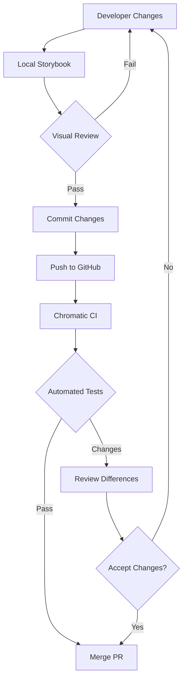
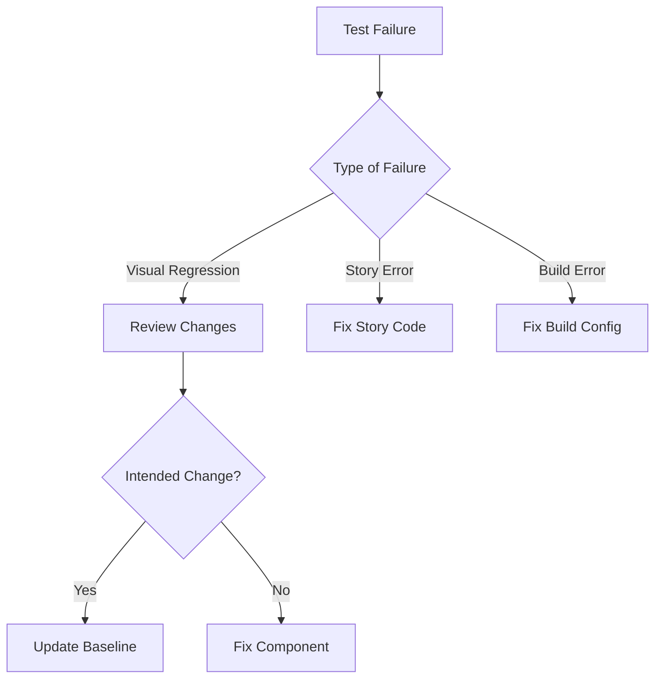

# Frontend Documentation

## Visual Regression Testing

We use Storybook and Chromatic for visual regression testing to ensure UI consistency across changes.

### Directory Structure
```
frontend/
├── .storybook/              # Storybook configuration
│   ├── main.ts             # Main configuration
│   └── preview.tsx         # Global decorators and styles
├── src/
│   └── components/
│       └── layout/         # Layout components
│           ├── __tests__/  # Unit tests
│           ├── stories/    # Component stories
│           └── index.ts    # Barrel exports
```

### Component Stories
Each component has dedicated stories:

1. **AppShell.stories.tsx**
   - Default layout (header + sidebar)
   - Header-only layout
   - Sidebar-only layout
   - Long content handling
   - Mobile responsiveness

2. **Header.stories.tsx**
   - Default navigation
   - Long navigation items
   - Custom branding
   - Mobile view
   - Theme switching

3. **Sidebar.stories.tsx**
   - Default navigation
   - Active route highlighting
   - Nested navigation items
   - Mobile collapsible view
   - Custom width variants

### Testing Flow


### Setup and Usage

1. **Local Development**
```bash
# Install dependencies
cd frontend
npm install

# Start Storybook
npm run storybook
```

2. **Writing Stories**
```typescript
// components/layout/stories/ComponentName.stories.tsx
import type { Meta, StoryObj } from "@storybook/react";
import { ComponentName } from "../ComponentName";

const meta: Meta<typeof ComponentName> = {
  title: "Layout/ComponentName",
  component: ComponentName,
};

export default meta;
```

3. **Running Tests**
```bash
# Run visual regression tests
npm run chromatic

# Update baselines (after approved changes)
npm run chromatic -- --auto-accept-changes
```

### Error Handling


### CI/CD Integration
- Runs on every PR
- Blocks merge on visual changes
- Requires explicit approval
- Maintains change history
